# Luồng Nghiệp Vụ Chính — VieGym

> Tài liệu mô tả các luồng nghiệp vụ end-to-end của VieGym, rút gọn từ `specs.md` v3.0 để phục vụ thiết kế, triển khai, kiểm thử và demo.
>
> **Phiên bản:** 3.0  
> **Ngày cập nhật:** 2026-08-19
>
> **Cập nhật v3.0:** bổ sung các luồng P0 còn thiếu (Register + OTP, Health Profile View/Edit + recalculation, Workout Session lifecycle, Media/Storage baseline), chuẩn hóa Admin Exercise/Food/Audit baseline ở P0 và Admin mở rộng ở P1, làm rõ AI Consent / Allowed Action Contract / Weight target review / Notification scope, và thêm bảng traceability đối chiếu SRS use case, feature ID, màn hình và subsystem.

---

## 1. Tổng quan luồng chính

VieGym xoay quanh hành trình người dùng từ lúc đăng ký tài khoản, hoàn thiện hồ sơ sức khỏe, thiết lập thiết bị tập luyện, theo dõi luyện tập/dinh dưỡng/cân nặng, nhận tư vấn AI và xử lý các recommendation có kiểm soát.

```text
Guest
  └── Đăng ký / Đăng nhập / Google Login
        └── Hoàn thiện hồ sơ sức khỏe
              └── Tính Health Metrics
                    └── Chọn thiết bị có sẵn
                          └── Dashboard cá nhân
                                ├── Luyện tập
                                │     ├── Xem thư viện bài tập
                                │     ├── Tạo giáo án
                                │     ├── Tạo lịch tập
                                │     └── Ghi nhận buổi tập
                                ├── Dinh dưỡng
                                │     ├── Tìm món ăn Việt Nam
                                │     └── Lập meal plan trong ngày
                                ├── Theo dõi cơ thể
                                │     └── Cập nhật cân nặng
                                ├── AI Coach
                                │     ├── AI Consent
                                │     ├── Chat cá nhân hóa
                                │     └── Daily Recommendation
                                │           ├── Apply
                                │           └── Dismiss
                                └── Settings
                                      ├── Equipment Preference
                                      └── User Preference

Admin
  └── Quản trị dữ liệu hệ thống
        ├── Bài tập / món ăn / Audit Log [P0]
        ├── User Management [P1]
        └── AI Rule / Prompt [P1]
```

Sơ đồ trực quan:

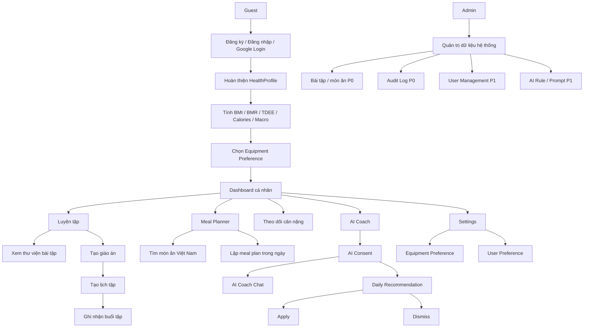
```mermaid
flowchart TD
    Guest[Guest] --> Auth[Đăng ký / Đăng nhập / Google Login]
    Auth --> Health[Hoàn thiện HealthProfile]
    Health --> Metrics[Tính BMI / BMR / TDEE / Calories / Macro]
    Metrics --> Equipment[Chọn Equipment Preference]
    Equipment --> Dashboard[Dashboard cá nhân]

    Dashboard --> Workout[Luyện tập]
    Dashboard --> Nutrition[Meal Planner]
    Dashboard --> Body[Theo dõi cân nặng]
    Dashboard --> AI[AI Coach]
    Dashboard --> Settings[Settings]

    Workout --> Exercise[Xem thư viện bài tập]
    Workout --> Program[Tạo giáo án]
    Program --> Schedule[Tạo lịch tập]
    Schedule --> Log[Ghi nhận buổi tập]

    Nutrition --> Food[Tìm món ăn Việt Nam]
    Nutrition --> MealPlan[Lập meal plan trong ngày]

    AI --> Consent[AI Consent]
    Consent --> Coach[AI Coach Chat]
    Consent --> Recommendation[Daily Recommendation]
    Recommendation --> Apply[Apply]
    Recommendation --> Dismiss[Dismiss]

    Settings --> EquipmentSettings[Equipment Preference]
    Settings --> Preference[User Preference]

    Admin[Admin] --> AdminPanel[Quản trị dữ liệu hệ thống]
    AdminPanel --> AdminData[Bài tập / món ăn P0]
    AdminPanel --> Audit[Audit Log P0]
    AdminPanel --> AdminUser[User Management P1]
    AdminPanel --> AdminAI[AI Rule / Prompt P1]
```

Nguyên tắc tổng quát:

- `HealthProfile` và `NutritionTarget` là dữ liệu nền cho Dashboard, Meal Planner và AI Coach.
- Backend Spring Boot là business authority và source of truth.
- Mobile App chỉ giao tiếp với Backend qua REST API/HTTPS.
- AI Service không truy cập database trực tiếp.
- AI chỉ nhận context cần thiết do Backend authorize, consent-check và lọc theo whitelist.
- Backend tính các metric authoritative; AI chỉ diễn giải và đề xuất.
- User là người quyết định cuối cùng đối với thay đổi do AI đề xuất.
- AI không tự mutation dữ liệu nghiệp vụ.

---

## 2. Luồng đăng ký, đăng nhập và hồ sơ sức khỏe

Luồng này là cửa vào chính của MVP. User cần xác thực và hoàn thiện hồ sơ sức khỏe trước khi hệ thống có đủ dữ liệu để tính calories, macro, dashboard và tư vấn AI.

```text
Guest mở app
  ↓
Chọn đăng ký / đăng nhập / Google Login
  ↓
Backend xác thực thông tin
  ↓
Nếu hợp lệ, Backend cấp Access Token và Refresh Token
  ↓
Kiểm tra trạng thái tài khoản
  ├── Tài khoản bị khóa / vô hiệu hóa
  │     └── Từ chối đăng nhập
  └── Tài khoản hợp lệ
        ↓
      Kiểm tra HealthProfile
        ├── Chưa có hoặc thiếu dữ liệu bắt buộc
        │     └── Điều hướng sang onboarding hồ sơ sức khỏe
        └── Đã hoàn thiện
              └── Kiểm tra Equipment Preference
                    ├── Chưa có
                    │     └── Điều hướng chọn thiết bị
                    └── Đã có
                          └── Hiển thị Dashboard cá nhân
```

Luồng onboarding hồ sơ sức khỏe:

```text
User nhập thông tin sức khỏe
  ├── Tuổi / ngày sinh
  ├── Giới tính
  ├── Chiều cao
  ├── Cân nặng
  ├── Mức độ vận động
  ├── Mục tiêu tập luyện
  └── Kinh nghiệm tập luyện
  ↓
Backend validate dữ liệu bắt buộc
  ↓
Tính BMI, BMR, TDEE
  ↓
Tính calories và macro mục tiêu
  ↓
Lưu HealthProfile / WeightLog và NutritionTarget khi calculation COMPLETE
  ↓
Chuyển sang Equipment Preference
  ↓
Dashboard, Meal Planner và AI Coach sử dụng dữ liệu này
```

Sơ đồ trực quan:

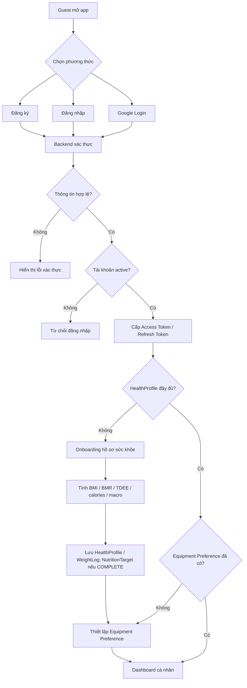
```mermaid
flowchart TD
    Guest[Guest mở app] --> Method{Chọn phương thức}
    Method --> Register[Đăng ký]
    Method --> Login[Đăng nhập]
    Method --> Google[Google Login]

    Register --> Verify[Backend xác thực]
    Login --> Verify
    Google --> Verify

    Verify --> Valid{Thông tin hợp lệ?}
    Valid -- Không --> AuthError[Hiển thị lỗi xác thực]
    Valid -- Có --> Account{Tài khoản active?}

    Account -- Không --> Blocked[Từ chối đăng nhập]
    Account -- Có --> Token[Cấp Access Token / Refresh Token]
    Token --> Profile{HealthProfile đầy đủ?}

    Profile -- Không --> Onboarding[Onboarding hồ sơ sức khỏe]
    Onboarding --> Calculate[Tính BMI / BMR / TDEE / calories / macro]
    Calculate --> SaveProfile[Lưu HealthProfile / WeightLog; NutritionTarget nếu COMPLETE]
    SaveProfile --> Equipment[Thiết lập Equipment Preference]
    Equipment --> Dashboard[Dashboard cá nhân]

    Profile -- Có --> EquipmentCheck{Equipment Preference đã có?}
    EquipmentCheck -- Không --> Equipment
    EquipmentCheck -- Có --> Dashboard
```

Kết quả:

- User có phiên đăng nhập hợp lệ.
- User có `HealthProfile` đầy đủ.
- Hệ thống có BMI, BMR, TDEE, calories mục tiêu và macro mục tiêu.
- User có `Equipment Preference` để phục vụ Exercise Library và Workout Builder.
- Dashboard, Meal Planner và AI Coach có dữ liệu nền thống nhất.

Business rules:

- Email phải duy nhất trong hệ thống.
- Mật khẩu phải được hash an toàn.
- Access Token dùng JWT và có thời hạn ngắn.
- Refresh Token phải có khả năng thu hồi khi user đăng xuất.
- OTP cho luồng đăng ký/khôi phục tài khoản phải có thời hạn, resend cooldown và giới hạn attempts/rate limit.
- Google Login phải được verify server-side.
- Biometric unlock chỉ dùng để mở khóa local session/token đã lưu an toàn trên thiết bị.
- Tài khoản bị khóa hoặc vô hiệu hóa không được đăng nhập.
- Nếu thiếu dữ liệu bắt buộc, hệ thống không tính TDEE và yêu cầu user hoàn thiện hồ sơ.
- Backend là nơi tính BMI, BMR, TDEE, calories và macro authoritative.

### 2.1. Luồng Register + OTP verification

Đăng ký tài khoản bằng email/mật khẩu yêu cầu xác thực OTP trước khi kích hoạt.

```text
User chọn Đăng ký
  ↓
Nhập email / mật khẩu / thông tin cơ bản
  ↓
Backend validate và tạo tài khoản ở trạng thái chưa xác thực
  ↓
Backend gửi OTP tới email
  ↓
User nhập OTP
  ↓
Backend kiểm tra OTP
  ├── Hợp lệ
  │     └── Kích hoạt tài khoản → cấp token → tiếp tục onboarding hồ sơ sức khỏe
  └── Không hợp lệ / hết hạn / vượt attempts
        └── Hiển thị lỗi và cho phép resend theo cooldown
```

Sơ đồ trực quan:

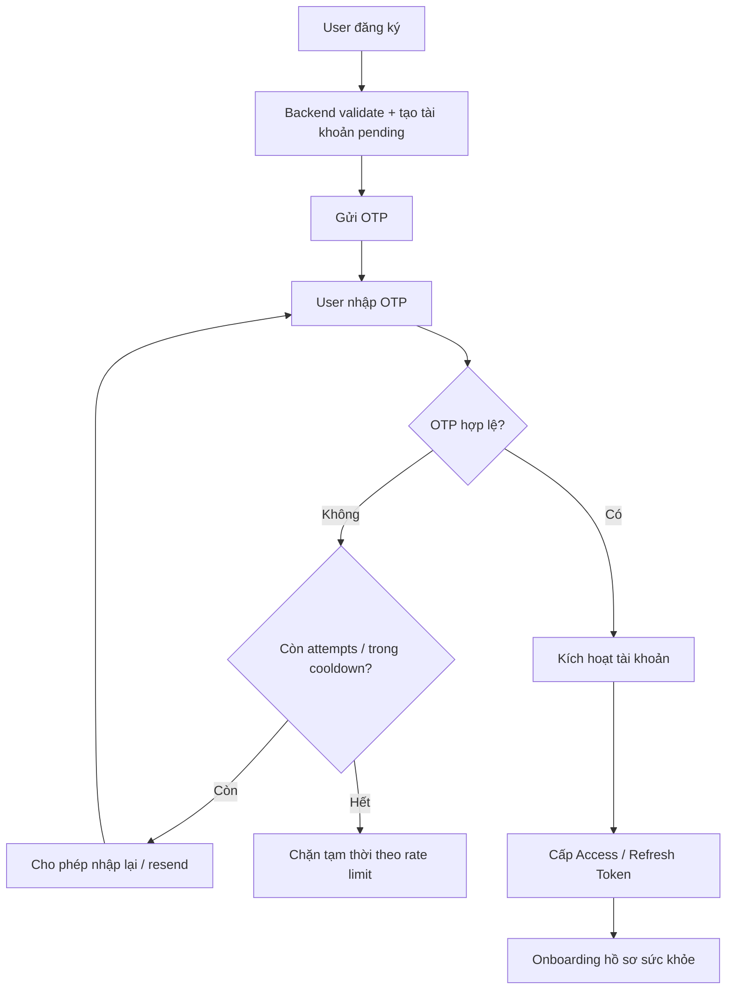
```mermaid
flowchart TD
    Register[User đăng ký] --> Validate[Backend validate + tạo tài khoản pending]
    Validate --> SendOTP[Gửi OTP]
    SendOTP --> Enter[User nhập OTP]
    Enter --> Check{OTP hợp lệ?}
    Check -- Không --> Fail{Còn attempts / trong cooldown?}
    Fail -- Còn --> Resend[Cho phép nhập lại / resend]
    Fail -- Hết --> Locked[Chặn tạm thời theo rate limit]
    Resend --> Enter
    Check -- Có --> Activate[Kích hoạt tài khoản]
    Activate --> Token[Cấp Access / Refresh Token]
    Token --> Onboarding[Onboarding hồ sơ sức khỏe]
```

Business rules:

- Tài khoản chưa verify OTP không được kích hoạt và không được cấp token nghiệp vụ.
- OTP có thời hạn, có resend cooldown và giới hạn attempts/rate limit.
- OTP dùng chung cơ chế cho đăng ký và khôi phục tài khoản.
- Không tiết lộ email có tồn tại hay không qua thông báo lỗi OTP.

### 2.2. Luồng cập nhật Health Profile và tính lại metric

User có thể chỉnh sửa hồ sơ sức khỏe sau onboarding; Backend tính lại các metric authoritative.

```text
User mở Health Profile trong Profile / Settings
  ↓
Xem BMI / BMR / TDEE / calories / macro hiện tại
  ↓
Chỉnh chiều cao / cân nặng / mức vận động / mục tiêu / kinh nghiệm
  ↓
Backend validate dữ liệu bắt buộc
  ↓
Backend tính lại BMI / BMR / TDEE / calories / macro
  ↓
Cập nhật HealthProfile / NutritionTarget nếu hợp lệ
  ↓
Dashboard / Meal Planner / AI context dùng metric mới
```

Sơ đồ trực quan:

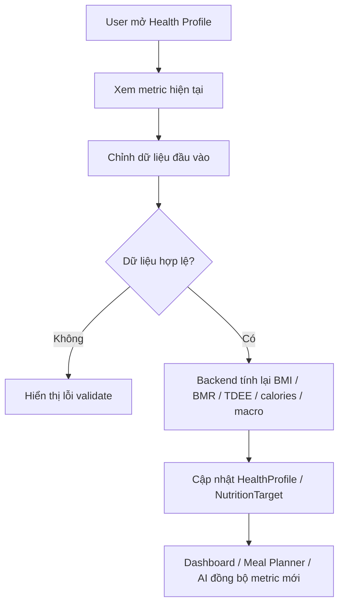
```mermaid
flowchart TD
    Open[User mở Health Profile] --> View[Xem metric hiện tại]
    View --> Edit[Chỉnh dữ liệu đầu vào]
    Edit --> Validate{Dữ liệu hợp lệ?}
    Validate -- Không --> Error[Hiển thị lỗi validate]
    Validate -- Có --> Recalculate[Backend tính lại BMI / BMR / TDEE / calories / macro]
    Recalculate --> Save[Cập nhật HealthProfile / NutritionTarget]
    Save --> Sync[Dashboard / Meal Planner / AI đồng bộ metric mới]
```

Business rules:

- User không chỉnh sửa trực tiếp BMI / BMR / TDEE; các giá trị này do Backend tính.
- Backend là nơi tính lại metric authoritative khi input thay đổi.
- Cập nhật Health Profile không làm thay đổi WorkoutLog / WeightLog lịch sử.
- User chỉ xem và chỉnh sửa Health Profile của chính mình.

---

## 3. Luồng Dashboard cá nhân

Dashboard là điểm tổng hợp sau khi user đăng nhập, giúp user nắm nhanh tình trạng dinh dưỡng, luyện tập, cơ thể và các recommendation phù hợp.

```text
User mở Dashboard
  ↓
Backend lấy dữ liệu cá nhân
  ├── HealthProfile / NutritionTarget
  ├── MealPlan hôm nay
  ├── WorkoutSchedule hôm nay / buổi tập tiếp theo
  ├── WeightLog mới nhất / trend
  └── AI Daily Recommendation nếu có
  ↓
Backend tổng hợp Dashboard
  ↓
App hiển thị tổng quan
  ├── Calories, macro đã nạp / mục tiêu / còn lại
  ├── Lịch tập hôm nay và tỷ lệ hoàn thành tuần
  ├── Cân nặng hiện tại, BMI và tiến độ mục tiêu
  └── Daily Recommendation
```

Sơ đồ trực quan:

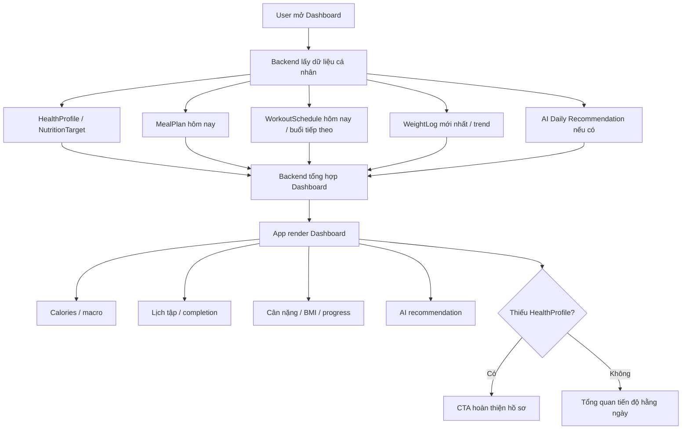
```mermaid
flowchart TD
    Open[User mở Dashboard] --> Fetch[Backend lấy dữ liệu cá nhân]

    Fetch --> Health[HealthProfile / NutritionTarget]
    Fetch --> Meal[MealPlan hôm nay]
    Fetch --> Schedule[WorkoutSchedule hôm nay / buổi tiếp theo]
    Fetch --> Weight[WeightLog mới nhất / trend]
    Fetch --> Recommendation[AI Daily Recommendation nếu có]

    Health --> Aggregate[Backend tổng hợp Dashboard]
    Meal --> Aggregate
    Schedule --> Aggregate
    Weight --> Aggregate
    Recommendation --> Aggregate

    Aggregate --> Render[App render Dashboard]

    Render --> NutritionCard[Calories / macro]
    Render --> WorkoutCard[Lịch tập / completion]
    Render --> BodyCard[Cân nặng / BMI / progress]
    Render --> AICard[AI recommendation]

    Render --> Missing{Thiếu HealthProfile?}
    Missing -- Có --> CompleteProfile[CTA hoàn thiện hồ sơ]
    Missing -- Không --> DailyOverview[Tổng quan tiến độ hằng ngày]
```

Kết quả:

- User có một màn hình tổng quan để theo dõi tiến độ hằng ngày.
- Các thay đổi từ Meal Planner, Workout Log và Weight Log được phản ánh lại trên Dashboard.
- Mobile không tự tính lại các metric authoritative do Backend cung cấp.

Business rules:

- Dashboard chỉ hiển thị dữ liệu của chính user đang đăng nhập.
- Nếu thiếu `HealthProfile`, Dashboard phải hiển thị yêu cầu hoàn thiện hồ sơ.
- Nếu chưa có meal plan, lịch tập hoặc weight log, app hiển thị empty state dễ hiểu thay vì dữ liệu giả.
- AI recommendation chỉ hiển thị khi recommendation còn hiệu lực và thuộc user hiện tại.
- Dashboard là read model thuần: không gọi FastAPI/AI Provider, không tạo hoặc regenerate recommendation.
- Ngày Dashboard do Backend diễn giải theo timezone IANA trong UserProfile; client có thể gửi ngày tường minh để browse.

---

## 4. Luồng luyện tập

Luồng luyện tập gồm bốn phần chính: thiết lập thiết bị, xem thư viện bài tập, tạo giáo án/lịch tập và ghi nhận buổi tập.

### 4.1. Gym Equipment Preference

```text
Onboarding / User vào Settings
  ↓
Xem danh sách thiết bị
  ├── BODYWEIGHT
  ├── DUMBBELL
  ├── BARBELL
  ├── BENCH
  ├── CABLE_MACHINE
  ├── MACHINE
  ├── RESISTANCE_BAND
  ├── KETTLEBELL
  ├── PULL_UP_BAR
  └── TREADMILL
  ↓
User chọn / bỏ chọn / reset
  ↓
Backend lưu UserPreference.available_equipment
  ↓
Exercise Library / Workout Builder ưu tiên bài phù hợp
```

Business rules:

- User không phải chọn lại thiết bị ở mỗi buổi tập.
- User có thể chỉnh sửa equipment trong Settings bất kỳ lúc nào.
- Thay đổi equipment preference không làm thay đổi WorkoutLog cũ.
- Nếu chưa chọn thiết bị, ưu tiên BODYWEIGHT và bài không yêu cầu thiết bị đặc thù.
- “Full gym” có thể được seed bằng các equipment phổ biến.
- Nếu user không có thiết bị cần thiết, hệ thống giảm độ ưu tiên và có thể gợi ý bài thay thế cùng nhóm cơ.

### 4.2. Xem thư viện bài tập

```text
User vào tab Workout
  ↓
Backend trả danh sách Exercise đang active
  ↓
Áp dụng Equipment Preference để ưu tiên kết quả
  ↓
User tìm kiếm hoặc lọc
  ├── Theo tên bài tập
  ├── Theo nhóm cơ
  ├── Theo thiết bị
  └── Theo độ khó
  ↓
User xem chi tiết bài tập
  ├── Video hướng dẫn
  ├── Nhóm cơ chính / phụ
  ├── Thiết bị
  ├── Hướng dẫn thực hiện
  ├── Lỗi thường gặp
  └── Safety notes
```

Business rules:

- User chỉ thấy bài tập đang active.
- Exercise bị ẩn vẫn giữ được lịch sử log cũ nhưng không nên cho thêm vào program mới.
- Video có thể dùng URL/object storage/CDN hoặc asset demo hợp lệ.
- Nội dung hướng dẫn nên ưu tiên tiếng Việt.
- Equipment Preference chỉ ảnh hưởng việc ưu tiên/gợi ý, không xóa dữ liệu Exercise khỏi hệ thống.

### 4.3. Tạo giáo án tập

```text
User chọn tạo giáo án
  ↓
Chọn giáo án mẫu hoặc Custom
  ├── Push Pull Legs
  ├── Upper Lower
  ├── Full Body
  └── Custom
  ↓
Chọn bài tập
  ↓
Workout Builder ưu tiên bài phù hợp available_equipment
  ↓
Thiết lập sets, reps, rest time và note
  ↓
Backend lưu WorkoutProgram
```

Business rules:

- User có thể có nhiều `WorkoutProgram`.
- Mỗi user chỉ được có tối đa một giáo án `ACTIVE` tại một thời điểm.
- User có thể chỉnh sửa giáo án sau khi tạo.
- Nếu bài tập không phù hợp equipment, hệ thống giảm ưu tiên và có thể gợi ý bài thay thế cùng nhóm cơ.
- Việc thay đổi giáo án mới không làm thay đổi WorkoutLog lịch sử.

### 4.4. Tạo lịch tập

```text
User tạo lịch tập
  ├── Tạo thủ công
  └── Sinh lịch từ WorkoutProgram
  ↓
Chọn ngày và nội dung buổi tập
  ↓
Backend lưu WorkoutSchedule
  ↓
Trạng thái ban đầu = PLANNED
```

Trạng thái `WorkoutSchedule`:

- `PLANNED`: đã lên lịch.
- `COMPLETED`: đã hoàn thành.
- `MISSED`: đã quá hạn nhưng chưa hoàn thành.
- `CANCELLED`: đã hủy hợp lệ.

Business rules:

- User chỉ xem và chỉnh sửa lịch tập của chính mình.
- Mỗi user chỉ được có tối đa một `WorkoutProgram` `ACTIVE` tại một thời điểm.
- `CANCELLED` không tính vào mẫu số `completionRate` nếu user hủy hợp lệ.
- Lịch tương lai không vào mẫu số; cửa sổ mặc định là Thứ Hai đến ngày nghiệp vụ hiện tại.
- Khi không có schedule eligible, `completionRate = null`. Schedule quá cutoff không được cancel để rút khỏi mẫu số.
- Notification nâng cao không thuộc core P0; nếu triển khai chỉ hoạt động khi user cho phép.

### 4.5. Ghi nhận buổi tập

```text
Đến ngày tập
  ↓
User mở WorkoutSchedule
  ↓
Nhập dữ liệu đã thực hiện
  ├── Exercise
  ├── Sets
  ├── Reps
  ├── Weight
  ├── Duration nếu có
  └── Completion
  ↓
Backend lưu WorkoutLog
  ↓
Backend tính
  ├── Volume
  ├── Completion Rate
  └── PR
  ↓
Cập nhật WorkoutSchedule = COMPLETED
  ↓
Dashboard cập nhật tiến độ
```

Sơ đồ trực quan:

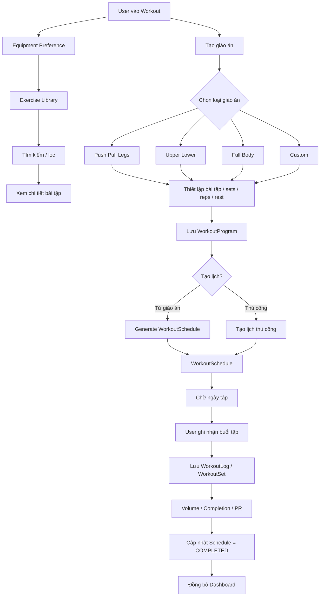
```mermaid
flowchart TD
    Start[User vào Workout] --> Equipment[Equipment Preference]
    Equipment --> Library[Exercise Library]
    Library --> Filter[Tìm kiếm / lọc]
    Filter --> Detail[Xem chi tiết bài tập]

    Start --> Build[Tạo giáo án]
    Build --> Template{Chọn loại giáo án}
    Template --> PPL[Push Pull Legs]
    Template --> UL[Upper Lower]
    Template --> FB[Full Body]
    Template --> Custom[Custom]

    PPL --> Program[Thiết lập bài tập / sets / reps / rest]
    UL --> Program
    FB --> Program
    Custom --> Program

    Program --> SaveProgram[Lưu WorkoutProgram]
    SaveProgram --> ScheduleChoice{Tạo lịch?}
    ScheduleChoice -- Từ giáo án --> Generate[Generate WorkoutSchedule]
    ScheduleChoice -- Thủ công --> Manual[Tạo lịch thủ công]
    Generate --> Schedule[WorkoutSchedule]
    Manual --> Schedule

    Schedule --> Wait[Chờ ngày tập]
    Wait --> Log[User ghi nhận buổi tập]
    Log --> SetLog[Lưu WorkoutLog / WorkoutSet]
    SetLog --> Calculate[Volume / Completion / PR]
    Calculate --> Complete[Cập nhật Schedule = COMPLETED]
    Complete --> Dashboard[Đồng bộ Dashboard]
```

Kết quả:

- User có lịch sử tập luyện theo thời gian.
- Hệ thống có dữ liệu để tính volume, PR và completion rate.
- Dashboard phản ánh tiến độ luyện tập mới nhất.

Business rules:

- User chỉ xem và chỉnh sửa workout log của chính mình.
- Backend là nơi tính volume, completion rate và PR.
- Exercise bị ẩn không làm mất lịch sử WorkoutLog.
- `WorkoutLog` cũ không bị thay đổi khi User cập nhật Equipment Preference.

### 4.6. Workout Session lifecycle

Ghi nhận buổi tập ở 4.5 có thể diễn ra dưới dạng một session có trạng thái, cho phép user bắt đầu, tạm dừng, tiếp tục và kết thúc buổi tập.

```text
User mở WorkoutSchedule đến ngày tập
  ↓
Start Session → trạng thái IN_PROGRESS
  ↓
Nhập set / reps / weight / duration theo từng bài
  ├── Rest timer giữa các set
  ├── Pause → PAUSED
  └── Resume → IN_PROGRESS
  ↓
Finish Session
  ↓
Backend lưu WorkoutLog / WorkoutSet
  ↓
Cập nhật WorkoutSchedule = COMPLETED
  ↓
Dashboard cập nhật tiến độ
```

Trạng thái session:

```text
READY là UI state, chưa có Session persisted
  └── Start → tạo Session IN_PROGRESS
        ├── Pause → PAUSED → Resume → IN_PROGRESS
        ├── Finish → COMPLETED
        └── Discard → DISCARDED
```

Sơ đồ trạng thái:

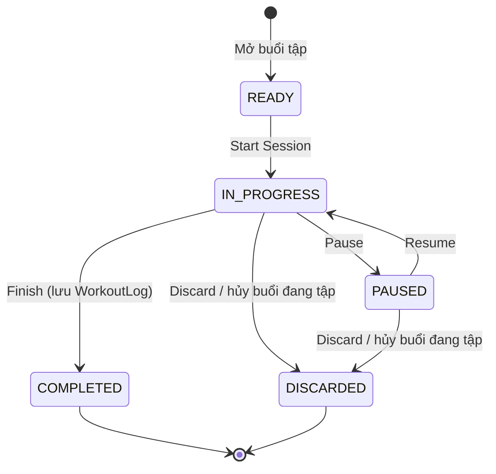
```mermaid
stateDiagram-v2
    [*] --> READY: Mở buổi tập
    READY --> IN_PROGRESS: Start Session
    IN_PROGRESS --> PAUSED: Pause
    PAUSED --> IN_PROGRESS: Resume
    IN_PROGRESS --> COMPLETED: Finish (lưu WorkoutLog)
    IN_PROGRESS --> DISCARDED: Discard / hủy buổi đang tập
    PAUSED --> DISCARDED: Discard / hủy buổi đang tập
    COMPLETED --> [*]
    DISCARDED --> [*]
```

Business rules:

- `WorkoutSchedule` chỉ chuyển sang `COMPLETED` khi session finish hợp lệ và WorkoutLog được lưu.
- Khi user thoát giữa chừng, app cho chọn tiếp tục hoặc xác nhận Discard; P0 không có draft session độc lập.
- Session `DISCARDED` không tạo WorkoutLog/PR. Schedule `CANCELLED` hợp lệ không tính vào mẫu số completion rate.
- Rest timer và Pause/Resume là hỗ trợ thao tác, không thay đổi cách Backend tính volume/PR.

---

## 5. Luồng Meal Planner

Meal Planner là luồng quản lý dinh dưỡng hằng ngày, tập trung vào cơ sở dữ liệu món ăn Việt Nam và so sánh calories/macro với mục tiêu cá nhân.

```text
User mở Meal Planner theo ngày
  ↓
Backend lấy hoặc tạo MealPlan cho ngày đó
  ↓
User tìm món ăn Việt Nam
  ↓
Backend chỉ trả Food đang active
  ↓
User xem thông tin dinh dưỡng theo khẩu phần
  ├── Calories
  ├── Protein
  ├── Carbohydrate
  └── Fat
  ↓
User thêm món vào bữa ăn
  ├── BREAKFAST
  ├── LUNCH
  ├── DINNER
  └── SNACK
  ↓
User điều chỉnh khẩu phần
  ├── Tô / chén / phần
  ├── Quả / ly / miếng
  ├── Gram
  └── Multiplier 0.5 / 1 / 1.5 / 2
  ↓
Backend lưu MealEntry
  ↓
Tính tổng calories và macro trong ngày
  ↓
So sánh với NutritionTarget
  ├── Vượt mục tiêu
  │     └── Hiển thị cảnh báo
  └── Còn thiếu
        └── Có thể tạo recommendation phù hợp
```

Sơ đồ trực quan:

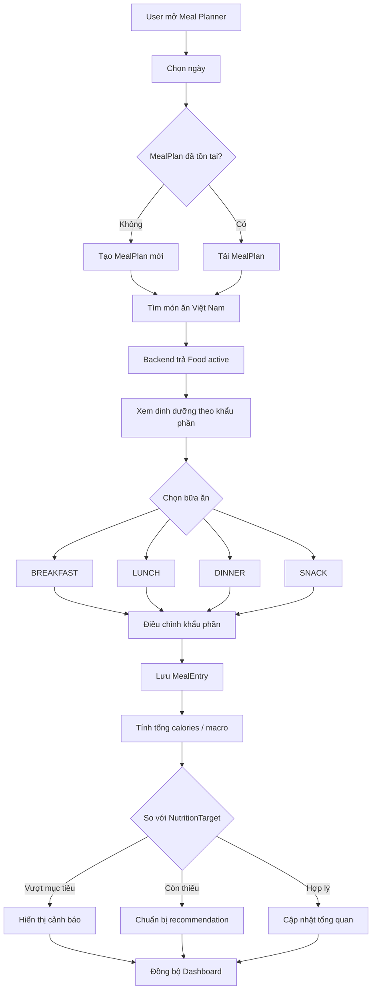
```mermaid
flowchart TD
    Open[User mở Meal Planner] --> Date[Chọn ngày]
    Date --> MealPlan{MealPlan đã tồn tại?}
    MealPlan -- Không --> Create[Tạo MealPlan mới]
    MealPlan -- Có --> Load[Tải MealPlan]
    Create --> Search[Tìm món ăn Việt Nam]
    Load --> Search

    Search --> Active[Backend trả Food active]
    Active --> Detail[Xem dinh dưỡng theo khẩu phần]
    Detail --> MealType{Chọn bữa ăn}
    MealType --> Breakfast[BREAKFAST]
    MealType --> Lunch[LUNCH]
    MealType --> Dinner[DINNER]
    MealType --> Snack[SNACK]

    Breakfast --> Serving[Điều chỉnh khẩu phần]
    Lunch --> Serving
    Dinner --> Serving
    Snack --> Serving

    Serving --> Entry[Lưu MealEntry]
    Entry --> Total[Tính tổng calories / macro]
    Total --> Compare{So với NutritionTarget}
    Compare -- Vượt mục tiêu --> Warning[Hiển thị cảnh báo]
    Compare -- Còn thiếu --> Suggest[Chuẩn bị recommendation]
    Compare -- Hợp lý --> Summary[Cập nhật tổng quan]

    Warning --> Dashboard[Đồng bộ Dashboard]
    Suggest --> Dashboard
    Summary --> Dashboard
```

Kết quả:

- User có meal plan theo từng ngày.
- Dashboard cập nhật calories/macro đã nạp và còn lại.
- AI Coach và Daily Recommendation có thể sử dụng nutrition summary khi AI personalization được bật.

Business rules:

- Mỗi user có một `MealPlan` theo từng ngày.
- Tổng calories/macro được tính bằng tổng các món đã thêm sau khi nhân khẩu phần.
- Dữ liệu nutrition được hiển thị là giá trị tham khảo khi nguồn chỉ là ước lượng.
- Food Database nội bộ phải có đủ dữ liệu demo món Việt Nam và không phụ thuộc hoàn toàn vào API bên ngoài.
- Preference về dị ứng/ràng buộc được ưu tiên hơn recommendation tối ưu macro.

---

## 6. Luồng theo dõi cân nặng

Luồng này giúp user theo dõi sự thay đổi cơ thể theo thời gian và cung cấp trend cho Dashboard và AI khi được phép.

```text
User nhập cân nặng theo ngày
  ↓
Backend kiểm tra WeightLog cùng ngày
  ├── Đã có
  │     └── Cập nhật WeightLog hiện có
  └── Chưa có
        └── Tạo WeightLog mới
  ↓
Cập nhật cân nặng hiện tại
  ↓
Nếu đây là log mới nhất: Backend tính lại BMI / BMR / TDEE; luôn tính trend / summary
  ↓
Dashboard hiển thị cân nặng, biểu đồ và mức thay đổi
  ↓
Nếu target có thể cần review
  └── Đề xuất review NutritionTarget
        └── User quyết định nếu có thay đổi nghiệp vụ
```

Sơ đồ trực quan:

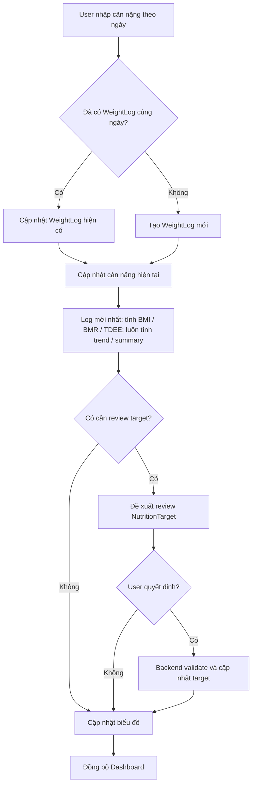
```mermaid
flowchart TD
    Input[User nhập cân nặng theo ngày] --> Check{Đã có WeightLog cùng ngày?}
    Check -- Có --> Update[Cập nhật WeightLog hiện có]
    Check -- Không --> Create[Tạo WeightLog mới]

    Update --> Current[Cập nhật cân nặng hiện tại]
    Create --> Current
    Current --> Calculate[Log mới nhất: tính BMI / BMR / TDEE; luôn tính trend / summary]
    Calculate --> Review{Có cần review target?}
    Review -- Có --> Suggest[Đề xuất review NutritionTarget]
    Review -- Không --> Chart[Cập nhật biểu đồ]
    Suggest --> UserDecision{User quyết định?}
    UserDecision -- Không --> Chart
    UserDecision -- Có --> UpdateTarget[Backend validate và cập nhật target]
    UpdateTarget --> Chart
    Chart --> Dashboard[Đồng bộ Dashboard]
```

Kết quả:

- User có lịch sử cân nặng theo ngày.
- Dashboard hiển thị cân nặng hiện tại, BMI, biểu đồ thay đổi và tiến độ mục tiêu.
- Weight trend có thể trở thành context cho AI khi consent cho phép.

Business rules:

- Một ngày chỉ có một bản ghi cân nặng chính.
- Nếu user nhập lại cùng ngày thì cập nhật bản ghi hiện có.
- API dùng ngày log làm natural key; create/update cùng ngày là một upsert idempotent.
- Backend tính trend/summary trước khi gửi context cho AI.
- Nếu log vừa thêm/sửa là log mới nhất, Backend đồng bộ `HealthProfile.currentWeightKg` và tính lại BMI/BMR/TDEE trong cùng transaction. Sửa log cũ không được làm lệch nguồn cân nặng hiện tại.
- Cân nặng thay đổi không tự động mutation NutritionTarget; AC-09 chỉ cấm đổi target, không cấm cập nhật metric phụ thuộc trực tiếp vào cân nặng.
- Nếu cần review target, hệ thống/AI chỉ tạo proposal dạng `REVIEW_NUTRITION_TARGET_PROPOSAL`, không tự thay đổi target.
- NutritionTarget chỉ được cập nhật sau khi User approval và Backend validation thành công.
- User chỉ xem và chỉnh sửa `WeightLog` của chính mình.

---

## 7. Luồng User Preference và Settings

User Preference là lớp lưu các thông tin cá nhân hóa được user chủ động khai báo và có thể được sử dụng bởi Exercise, Meal Planner và AI.

```text
User vào Settings
  ↓
Chọn User Preference
  ├── Món không thích
  ├── Dị ứng / ràng buộc
  ├── Available Equipment
  ├── Thời gian tập
  └── Meal Preference
  ↓
Backend validate
  ↓
Lưu UserPreference
  ↓
Các module sử dụng preference
  ├── Exercise Ranking
  ├── Workout Builder
  ├── Meal Recommendation
  └── AI Personalization
```

Sơ đồ trực quan:

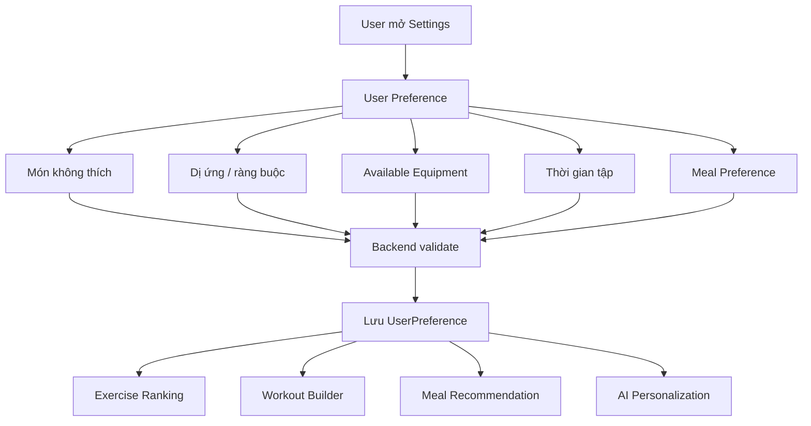
```mermaid
flowchart TD
    Settings[User mở Settings] --> Preference[User Preference]
    Preference --> Dislike[Món không thích]
    Preference --> Constraint[Dị ứng / ràng buộc]
    Preference --> Equipment[Available Equipment]
    Preference --> TrainingTime[Thời gian tập]
    Preference --> MealPreference[Meal Preference]

    Dislike --> Validate[Backend validate]
    Constraint --> Validate
    Equipment --> Validate
    TrainingTime --> Validate
    MealPreference --> Validate

    Validate --> Save[Lưu UserPreference]
    Save --> Exercise[Exercise Ranking]
    Save --> Workout[Workout Builder]
    Save --> Meal[Meal Recommendation]
    Save --> AI[AI Personalization]
```

Business rules:

- User có quyền thêm, sửa hoặc xóa preference của chính mình.
- Dị ứng/ràng buộc phải được ưu tiên hơn mục tiêu tối ưu calories/macros.
- Equipment Preference có thể chỉnh sửa riêng trong Settings.
- Khi AI personalization DISABLED, User Preference không được đưa vào AI context.
- Các module deterministic như Exercise Ranking, Workout Builder và Meal Planner vẫn có thể dùng preference do user khai báo nếu không gọi AI.

---

## 8. Luồng AI Consent và Privacy

AI personalization chỉ được sử dụng khi user chủ động bật consent.

```text
User vào Settings / AI
  ↓
Xem trạng thái AI Personalization
  ↓
Bật / Tắt
  ↓
Backend lưu AiConsentSetting
  ├── enabled
  ├── consent_version
  ├── accepted_at
  └── updated_at
```

Khi ENABLE:

```text
AI Request
  ↓
Authorization
  ↓
Consent Check = ENABLED
  ↓
Context Builder
  ↓
Personalized AI Flow
```

Khi DISABLE:

```text
AI Request
  ↓
Authorization
  ↓
Consent Check = DISABLED
  ↓
General Knowledge Mode
  ↓
Không đưa Health / Workout / Nutrition / Weight / Preference vào AI request / AI Service
```

Sơ đồ trực quan:

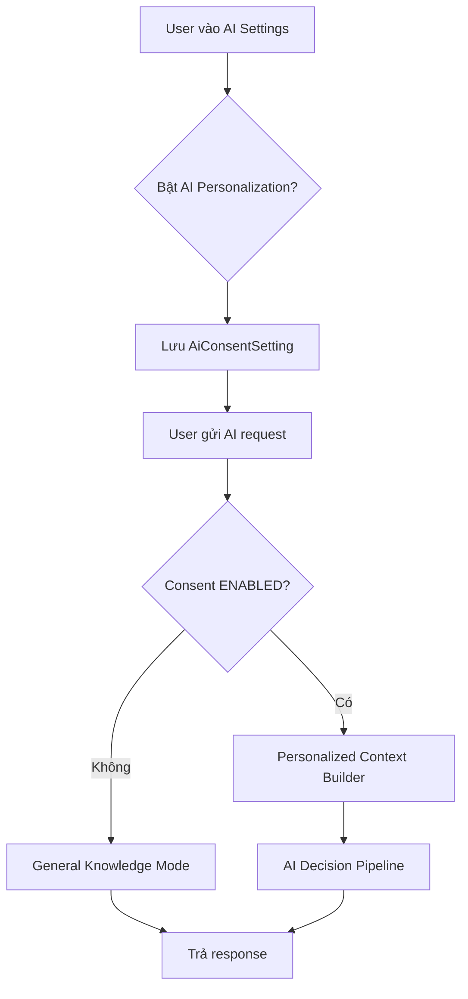
```mermaid
flowchart TD
    Settings[User vào AI Settings] --> Toggle{Bật AI Personalization?}
    Toggle --> SaveConsent[Lưu AiConsentSetting]
    SaveConsent --> Request[User gửi AI request]

    Request --> Check{Consent ENABLED?}
    Check -- Không --> General[General Knowledge Mode]
    Check -- Có --> Context[Personalized Context Builder]

    Context --> AIFlow[AI Decision Pipeline]
    General --> Response[Trả response]
    AIFlow --> Response
```

Kết quả:

- User kiểm soát việc sử dụng dữ liệu cá nhân cho AI.
- Consent được kiểm tra trước Context Builder.
- Khi OFF, AI không tạo Daily Recommendation cá nhân hóa.
- AI không được truy cập dữ liệu user khác.

Business rules:

- `AiConsentSetting` phải thuộc chính user.
- Consent phải có version và timestamp.
- AI Consent chỉ kiểm soát việc đưa personal context vào AI request / AI Service.
- Khi DISABLED, Backend không đưa personal context vào AI Service.
- Khi DISABLED, Dashboard, Exercise Ranking, Workout Builder và Meal Planner vẫn có thể dùng dữ liệu user theo logic deterministic nếu không gọi AI.
- User có thể bật/tắt personalization bất kỳ lúc nào.
- Consent history có thể lưu previous mode, new mode, version, changed_at và source.

---

## 9. Luồng AI Coach

AI Coach hỗ trợ user bằng tiếng Việt về luyện tập, dinh dưỡng, kỹ thuật tập và giải thích dữ liệu theo context được phép.

```text
User gửi câu hỏi cho AI Coach
  ↓
Backend xác thực user
  ↓
Kiểm tra AI Consent
  ├── DISABLED
  │     └── General Knowledge Mode
  └── ENABLED
        ↓
      Xác định tác vụ / intent
        ↓
      Context Builder
        ├── Health nếu liên quan
        ├── Health Metrics nếu liên quan
        ├── Workout nếu liên quan
        ├── Nutrition nếu liên quan
        ├── Weight nếu liên quan
        ├── Preference nếu liên quan
        └── Conversation summary + recent messages nếu cần
        ↓
      Rule Engine tạo signals nếu cần
        ↓
      Prompt Builder
        ↓
      FastAPI AI Service
        ↓
      AI Provider
        ↓
      Output Parser
        ↓
      Schema / Business / Safety Validation
        ↓
      Backend trả phản hồi về Mobile
        ↓
      Lưu Conversation
```

Sơ đồ trực quan:

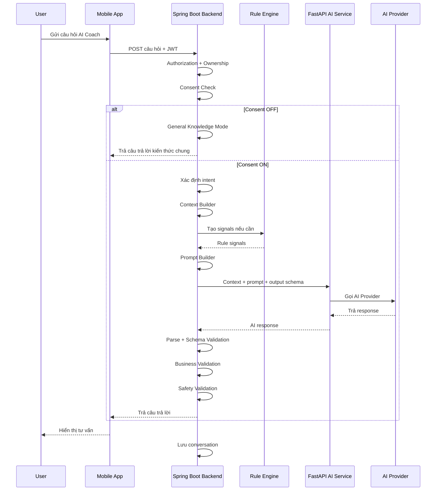
```mermaid
sequenceDiagram
    participant U as User
    participant App as Mobile App
    participant BE as Spring Boot Backend
    participant Rule as Rule Engine
    participant AI as FastAPI AI Service
    participant Provider as AI Provider

    U->>App: Gửi câu hỏi AI Coach
    App->>BE: POST câu hỏi + JWT
    BE->>BE: Authorization + Ownership
    BE->>BE: Consent Check

    alt Consent OFF
        BE->>BE: General Knowledge Mode
        BE-->>App: Trả câu trả lời kiến thức chung
    else Consent ON
        BE->>BE: Xác định intent
        BE->>BE: Context Builder
        BE->>Rule: Tạo signals nếu cần
        Rule-->>BE: Rule signals
        BE->>BE: Prompt Builder
        BE->>AI: Context + prompt + output schema
        AI->>Provider: Gọi AI Provider
        Provider-->>AI: Trả response
        AI-->>BE: AI response
        BE->>BE: Parse + Schema Validation
        BE->>BE: Business Validation
        BE->>BE: Safety Validation
        BE-->>App: Trả câu trả lời
    end

    App-->>U: Hiển thị tư vấn
    BE->>BE: Lưu conversation
```

Kết quả:

- User nhận được tư vấn bằng tiếng Việt.
- Personalized AI chỉ sử dụng context phù hợp với câu hỏi và consent.
- AI Service không tự truy cập database.
- AI response không được bypass validation.

Guardrails:

- AI không thay thế tư vấn y tế chuyên môn.
- Không chẩn đoán bệnh hoặc kê thuốc.
- Không khuyến nghị giảm cân cực đoan.
- Không yêu cầu password, API key hoặc token.
- Không tiết lộ system prompt, internal context hoặc dữ liệu user khác.
- User input, conversation history và dữ liệu import được xem là untrusted input.
- Prompt Builder phải phân vùng system instruction, context, user message, rule signals và output schema.

---

## 10. Luồng AI Daily Recommendation

Daily Recommendation là luồng AI personalization chính của MVP. Mỗi generation tạo 1–3 item;
P0 cho lần đầu và tối đa hai refresh/ngày. Generation mới thành công làm item `PENDING` của
generation cũ cùng ngày hết hiệu lực nhưng giữ lịch sử `APPLIED`/`DISMISSED`.

```text
Client chủ động gọi command Generate Daily Recommendation
  ↓
Backend kiểm tra AI Consent
  ├── DISABLED
  │     └── Không tạo personalized recommendation
  └── ENABLED
        ↓
      Backend tạo candidate signals theo rules-v1
        ├── calories remaining
        ├── nutrition_protein_gap
        ├── workout_today
        ├── adherence_issue
        ├── weight_trend_off_goal
        ├── meal_logging_drop
        ↓
      Rule Engine xác định WHAT
        ↓
      Backend dựng candidate shortlist đã lọc ownership/allergy/visibility
        ↓
      Context Builder tạo context tối thiểu
        ↓
      AI quyết định HOW
        ↓
      Tạo 1–3 recommendation
        ↓
      Output Parser
        ↓
      Schema Validation
        ↓
      Business Validation
        ↓
      Safety Validation
        ├── BLOCKED → chỉ lưu validation log, không lưu recommendation
        └── NORMAL/CAUTION
        ↓
      Lưu AiRecommendation = PENDING
        ↓
      Dashboard hiển thị recommendation
```

Sơ đồ trực quan:

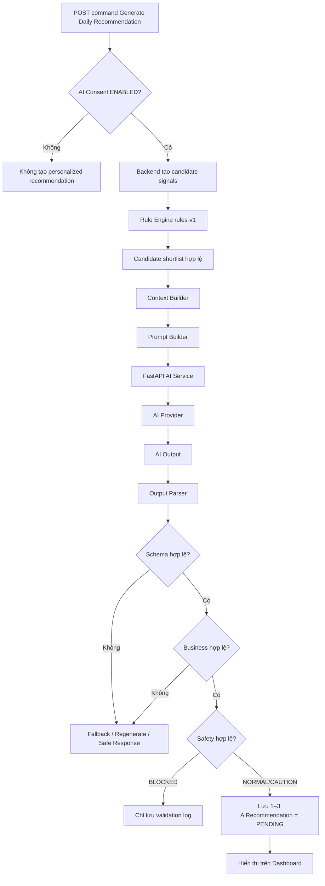
```mermaid
flowchart TD
    Trigger[POST command Generate Daily Recommendation] --> Consent{AI Consent ENABLED?}
    Consent -- Không --> NoRecommendation[Không tạo personalized recommendation]

    Consent -- Có --> Signals[Backend tạo candidate signals]
    Signals --> Rule[Rule Engine rules-v1]
    Rule --> Shortlist[Candidate shortlist hợp lệ]
    Shortlist --> Context[Context Builder]
    Context --> Prompt[Prompt Builder]
    Prompt --> AI[FastAPI AI Service]
    AI --> Provider[AI Provider]
    Provider --> Output[AI Output]

    Output --> Parse[Output Parser]
    Parse --> Schema{Schema hợp lệ?}
    Schema -- Không --> Fallback[Fallback / Regenerate / Safe Response]
    Schema -- Có --> Business{Business hợp lệ?}
    Business -- Không --> Fallback
    Business -- Có --> Safety{Safety hợp lệ?}
    Safety -- BLOCKED --> ValidationOnly[Chỉ lưu validation log]
    Safety -- NORMAL/CAUTION --> Recommendation[Lưu 1–3 AiRecommendation = PENDING]

    Recommendation --> Dashboard[Hiển thị trên Dashboard]
```

Recommendation có:

- `type`.
- `title`.
- `content`.
- `reason`.
- `priority`.
- `status`.
- `source_metrics`.
- `created_at`.
- `expires_at`.
- `safety_level`.

Nguyên tắc:

> **Rule Engine quyết định WHAT. AI quyết định HOW.**

Business rules:

- Chỉ tạo personalized recommendation khi consent ENABLED.
- Recommendation phải thuộc user hiện tại.
- Recommendation phải qua schema, business và safety validation.
- Recommendation mặc định có trạng thái `PENDING`.
- Endpoint đọc Daily Recommendation và Dashboard không gọi provider. Command generate chống gọi trùng bằng generation/batch key theo user + ngày nghiệp vụ.
- AI chỉ được tham chiếu Food/WorkoutDay trong candidate shortlist; ID ngoài shortlist bị reject.
- Recommendation `BLOCKED` không được persist; chỉ output `NORMAL`/`CAUTION` mới có thể thành PENDING.
- AI không được tự mutation database.
- Recommendation ưu tiên hành động nhỏ, có thể thực hiện ngay.
- Preference về dị ứng/ràng buộc được ưu tiên hơn recommendation tối ưu macro.

---

## 11. Luồng Apply / Dismiss Recommendation

Recommendation chỉ được thay đổi trạng thái khi user quyết định.

### 11.1. APPLY

```text
User xem recommendation
  ↓
Recommendation = PENDING
  ↓
User chọn APPLY
  ↓
Backend kiểm tra Authorization
  ↓
Kiểm tra Ownership
  ↓
Kiểm tra Recommendation còn PENDING
  ↓
Kiểm tra Allowed Action Contract
  ↓
Business Validation
  ↓
Safety Validation
  ↓
Backend thực hiện Database Mutation nếu hợp lệ
  ↓
Ghi Audit Log
  ↓
Recommendation = APPLIED
  ↓
Dashboard cập nhật
```

### 11.2. DISMISS

```text
User xem recommendation
  ↓
Recommendation = PENDING
  ↓
User chọn DISMISS
  ↓
Backend kiểm tra Ownership
  ↓
Lưu feedback nếu có
  ↓
Recommendation = DISMISSED
  ↓
Không mutation business data
```

Sơ đồ trực quan:

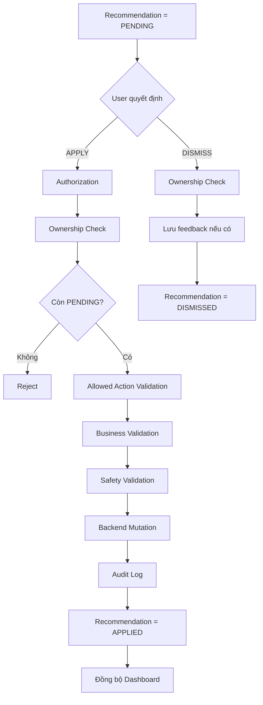
```mermaid
flowchart TD
    Recommendation[Recommendation = PENDING] --> Decision{User quyết định}
    Decision -- APPLY --> Auth[Authorization]
    Auth --> Owner[Ownership Check]
    Owner --> Pending{Còn PENDING?}
    Pending -- Không --> Error[Reject]
    Pending -- Có --> Action[Allowed Action Validation]
    Action --> Business[Business Validation]
    Business --> Safety[Safety Validation]
    Safety --> Mutation[Backend Mutation]
    Mutation --> Audit[Audit Log]
    Audit --> Applied[Recommendation = APPLIED]
    Applied --> Dashboard[Đồng bộ Dashboard]

    Decision -- DISMISS --> DismissOwner[Ownership Check]
    DismissOwner --> Feedback[Lưu feedback nếu có]
    Feedback --> Dismissed[Recommendation = DISMISSED]
```

State machine:

```text
PENDING
  ├── APPLY hợp lệ → APPLIED
  ├── DISMISS → DISMISSED
  └── hết hạn → EXPIRED
```

Sơ đồ trạng thái:

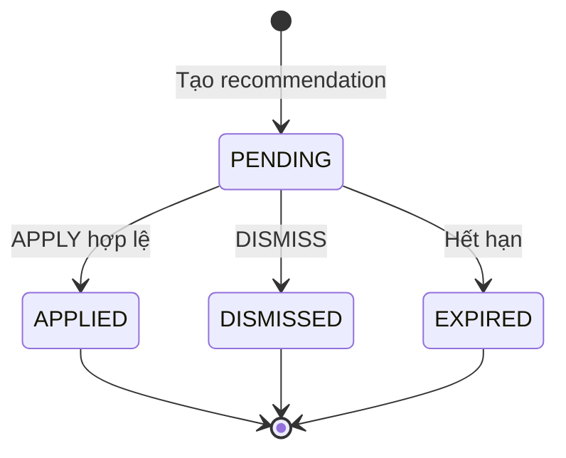
```mermaid
stateDiagram-v2
    [*] --> PENDING: Tạo recommendation
    PENDING --> APPLIED: APPLY hợp lệ
    PENDING --> DISMISSED: DISMISS
    PENDING --> EXPIRED: Hết hạn
    APPLIED --> [*]
    DISMISSED --> [*]
    EXPIRED --> [*]
```

Allowed Action Contract:

```text
NONE
ADD_MEAL_ENTRY_PROPOSAL
CREATE_WORKOUT_SCHEDULE_PROPOSAL
UPDATE_USER_PREFERENCE_PROPOSAL
REVIEW_NUTRITION_TARGET_PROPOSAL
LOG_REMINDER_ONLY
```

`LOG_REMINDER_ONLY` là reserved cho P1 và không được gửi trong allowed-actions P0.

Business rules:

- Chỉ recommendation `PENDING` mới được APPLY/DISMISS.
- User chỉ APPLY/DISMISS recommendation thuộc chính mình.
- AI không được tự gọi mutation endpoint.
- AI chỉ đề xuất action; Backend chỉ mutation sau khi User APPLY và validate thành công.
- APPLY chỉ thực hiện mutation sau khi Backend validation thành công.
- DISMISS không làm thay đổi business data.
- Action của AI phải nằm trong Allowed Action Contract whitelist.
- Action ngoài whitelist bị reject.
- Payload action không được chứa SQL, endpoint command, token, API key hoặc field ngoài whitelist.
- Meal/Schedule proposal bắt buộc có `targetDate` và chỉ tham chiếu candidate ID do Backend cung cấp.
- Preference proposal không được chứa `allergies` hoặc `dietary_constraints`.

---

## 12. Luồng Admin

Admin baseline là phạm vi P0 cho các dữ liệu cần phục vụ demo và vận hành tối thiểu: quản lý bài tập, món ăn Việt Nam và audit log. User Management, Admin Dashboard, Import CSV/Excel, AI Rule và Prompt Version là P1, chỉ triển khai sau khi P0 ổn định.

```text
Admin đăng nhập
  ↓
Backend xác thực JWT và role ADMIN
  ↓
Admin truy cập màn quản trị
  ├── Quản lý người dùng            [P1]
  ├── Quản lý bài tập               [P0]
  ├── Quản lý món ăn Việt Nam       [P0]
  ├── Audit Log                     [P0]
  ├── Dashboard admin               [P1]
  ├── Import CSV/Excel              [P1]
  ├── Quản lý AI Rule               [P1]
  └── Quản lý Prompt Version        [P1]
  ↓
Admin thực hiện thao tác quản trị
  ↓
Backend validate quyền và dữ liệu
  ↓
Backend cập nhật hệ thống
  ↓
Ghi audit log cho thao tác quan trọng
```

Sơ đồ trực quan:

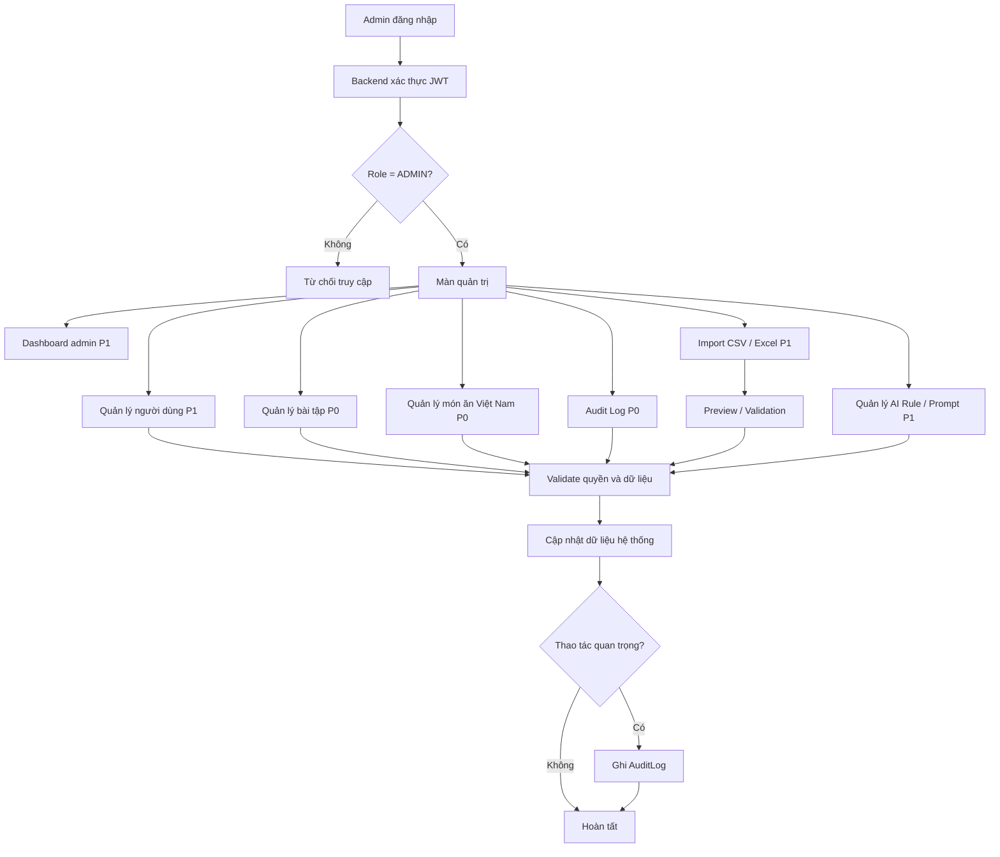
```mermaid
flowchart TD
    Login[Admin đăng nhập] --> Auth[Backend xác thực JWT]
    Auth --> Role{Role = ADMIN?}
    Role -- Không --> Deny[Từ chối truy cập]
    Role -- Có --> Panel[Màn quản trị]

    Panel --> Users[Quản lý người dùng P1]
    Panel --> Exercises[Quản lý bài tập P0]
    Panel --> Foods[Quản lý món ăn Việt Nam P0]
    Panel --> AuditBase[Audit Log P0]
    Panel --> Dashboard[Dashboard admin P1]
    Panel --> Import[Import CSV / Excel P1]
    Panel --> AIRules[Quản lý AI Rule / Prompt P1]

    Users --> Validate[Validate quyền và dữ liệu]
    Exercises --> Validate
    Foods --> Validate
    AuditBase --> Validate
    Import --> Preview[Preview / Validation]
    Preview --> Validate
    AIRules --> Validate

    Validate --> Update[Cập nhật dữ liệu hệ thống]
    Update --> Audit{Thao tác quan trọng?}
    Audit -- Có --> AuditLog[Ghi AuditLog]
    Audit -- Không --> Done[Hoàn tất]
    AuditLog --> Done
```

Kết quả:

- Dữ liệu bài tập và món ăn được quản trị tập trung.
- Admin có thể quản lý AI Rule/Prompt ở phạm vi P1.
- Các thao tác quan trọng có audit log.

Business rules:

- Admin baseline P0 gồm quản lý bài tập, món ăn và audit log; User Management và các phần mở rộng còn lại là P1.
- Admin không được xem mật khẩu, refresh token hoặc API key.
- Import CSV/Excel phải có preview và validation trước khi lưu.
- Xóa dữ liệu chính nên dùng soft delete.
- Audit log không chứa password, token, API key hoặc raw personal context thừa.
- Admin vẫn phải tuân thủ phân quyền đối với dữ liệu cá nhân.

### 12.1. Luồng Media / Storage baseline

Media/Storage baseline (P0) phục vụ hiển thị video/ảnh cho Exercise và Food.

```text
Admin upload video / ảnh cho Exercise hoặc Food
  ↓
Backend validate MIME type / extension / size
  ↓
Lưu file vào Object Storage hoặc dùng demo URL / asset hợp lệ
  ↓
Lưu metadata / object key
  ↓
Exercise / Food tham chiếu media qua metadata
```

Sơ đồ trực quan:

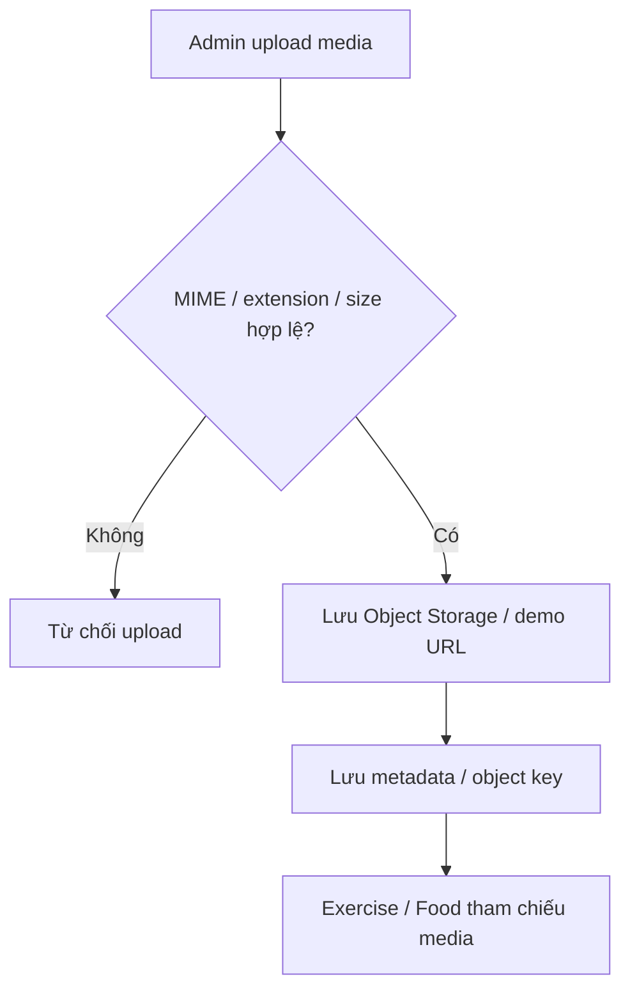
```mermaid
flowchart TD
    Upload[Admin upload media] --> Validate{MIME / extension / size hợp lệ?}
    Validate -- Không --> Reject[Từ chối upload]
    Validate -- Có --> Store[Lưu Object Storage / demo URL]
    Store --> Meta[Lưu metadata / object key]
    Meta --> Reference[Exercise / Food tham chiếu media]
```

Business rules:

- Không lưu binary trực tiếp trong database nghiệp vụ; chỉ lưu metadata/object key.
- P0 chỉ cần baseline media cho demo Exercise/Food; có thể dùng demo URL/asset hợp lệ.
- Upload media phải validate MIME type, kích thước và extension.
- P0 phải đánh dấu/xóa idempotent upload orphan tối thiểu theo TTL và không xóa object còn được
  tham chiếu. Đối soát quy mô lớn, CDN và lifecycle policy nâng cao là P2/Future.

---

## 13. Luồng bảo mật và phân quyền

Luồng bảo mật áp dụng cho toàn bộ API riêng tư của hệ thống.

```text
Client gọi API riêng tư
  ↓
Backend kiểm tra Access Token
  ↓
Xác định userId và role
  ↓
Kiểm tra quyền truy cập tài nguyên
  ├── USER
  │     └── Chỉ truy cập dữ liệu thuộc chính mình
  └── ADMIN
        └── Truy cập API quản trị theo role
  ↓
Nếu hợp lệ
  └── Xử lý nghiệp vụ
  ↓
Nếu không hợp lệ
  └── Trả lỗi xác thực hoặc phân quyền
```

Sơ đồ trực quan:

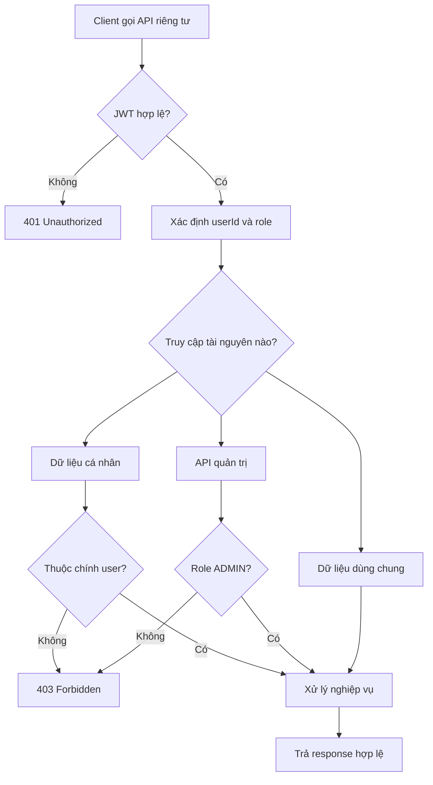
```mermaid
flowchart TD
    Request[Client gọi API riêng tư] --> Token{JWT hợp lệ?}
    Token -- Không --> Unauthorized[401 Unauthorized]
    Token -- Có --> Identity[Xác định userId và role]

    Identity --> Resource{Truy cập tài nguyên nào?}
    Resource --> OwnData[Dữ liệu cá nhân]
    Resource --> AdminAPI[API quản trị]
    Resource --> PublicData[Dữ liệu dùng chung]

    OwnData --> Owner{Thuộc chính user?}
    Owner -- Không --> Forbidden[403 Forbidden]
    Owner -- Có --> Process[Xử lý nghiệp vụ]

    AdminAPI --> IsAdmin{Role ADMIN?}
    IsAdmin -- Không --> Forbidden
    IsAdmin -- Có --> Process

    PublicData --> Process
    Process --> Response[Trả response hợp lệ]
```

Business rules:

- API private bắt buộc có JWT hợp lệ.
- Backend phải kiểm tra authorization, không chỉ ẩn nút hoặc màn hình ở frontend.
- User không được xem `HealthProfile`, `MealPlan`, `WorkoutLog`, `WeightLog` hoặc dữ liệu cá nhân của user khác.
- AI Provider API key, JWT secret và credential chỉ lưu server-side.
- AI Service không có quyền truy cập PostgreSQL trực tiếp.
- Upload media cần validate MIME type, kích thước và extension.

---

## 14. Luồng AI Architecture tổng quát

Đây là luồng kiến trúc dùng chung cho AI Coach và Daily Recommendation.

```text
Flutter Mobile App
  ↓
Spring Boot Backend
  ↓
Authorization
  ↓
AI Consent Check
  ↓
Context Builder
  ↓
Rule Engine nếu tác vụ cần signals
  ↓
Prompt Builder
  ↓
FastAPI AI Service
  ↓
AI Provider
  ↓
Output Parser
  ↓
Schema Validation
  ↓
Business Validation
  ↓
Safety Validation
  ↓
Spring Boot Backend
  ↓
Flutter Mobile App
```

Sơ đồ trực quan:

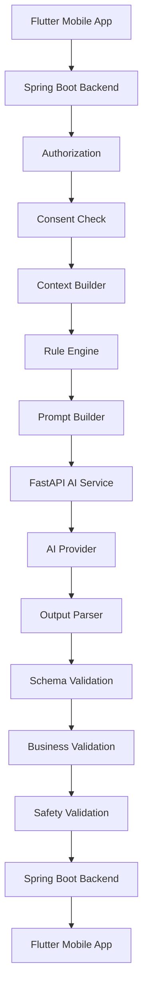
```mermaid
flowchart TD
    Mobile[Flutter Mobile App] --> Backend[Spring Boot Backend]
    Backend --> Auth[Authorization]
    Auth --> Consent[Consent Check]
    Consent --> Context[Context Builder]
    Context --> Rule[Rule Engine]
    Rule --> Prompt[Prompt Builder]
    Prompt --> AI[FastAPI AI Service]
    AI --> Provider[AI Provider]
    Provider --> Parser[Output Parser]
    Parser --> Schema[Schema Validation]
    Schema --> Business[Business Validation]
    Business --> Safety[Safety Validation]
    Safety --> BackendResponse[Spring Boot Backend]
    BackendResponse --> MobileResponse[Flutter Mobile App]
```

Nguyên tắc:

- AI Service là stateless decision-support component.
- AI Service không phải business authority.
- AI Service không phải authorization layer.
- AI Service không sở hữu database.
- Business logic không phụ thuộc trực tiếp vào SDK/provider cụ thể.
- Provider credential chỉ nằm server-side.
- Context phải áp dụng data minimization.
- Conversation history sử dụng summary + recent messages thay vì gửi toàn bộ lịch sử trong mọi request.

---

## 15. Luồng MVP End-to-End

Luồng này dùng làm flow chính cho demo đồ án.

```text
Guest
  ↓
Register / Login
  ↓
Health Profile
  ↓
BMI / BMR / TDEE / Calories / Macro
  ↓
Equipment Preference
  ↓
Dashboard
  ├── Exercise Library
  │     ↓
  │   Workout Builder
  │     ↓
  │   Workout Schedule
  │     ↓
  │   Workout Log
  │
  ├── Food Database
  │     ↓
  │   Meal Planner
  │
  ├── Weight Tracking
  │
  └── AI Consent
        ↓
      AI Coach
        ↓
      Daily Recommendation
        ↓
      PENDING
       ├── APPLY
       │     ↓
       │   Backend Validation
       │     ↓
       │   Mutation
       │     ↓
       │   Audit
       │
       └── DISMISS
             ↓
           Feedback
  ↓
Dashboard cập nhật
```

Sơ đồ trực quan:

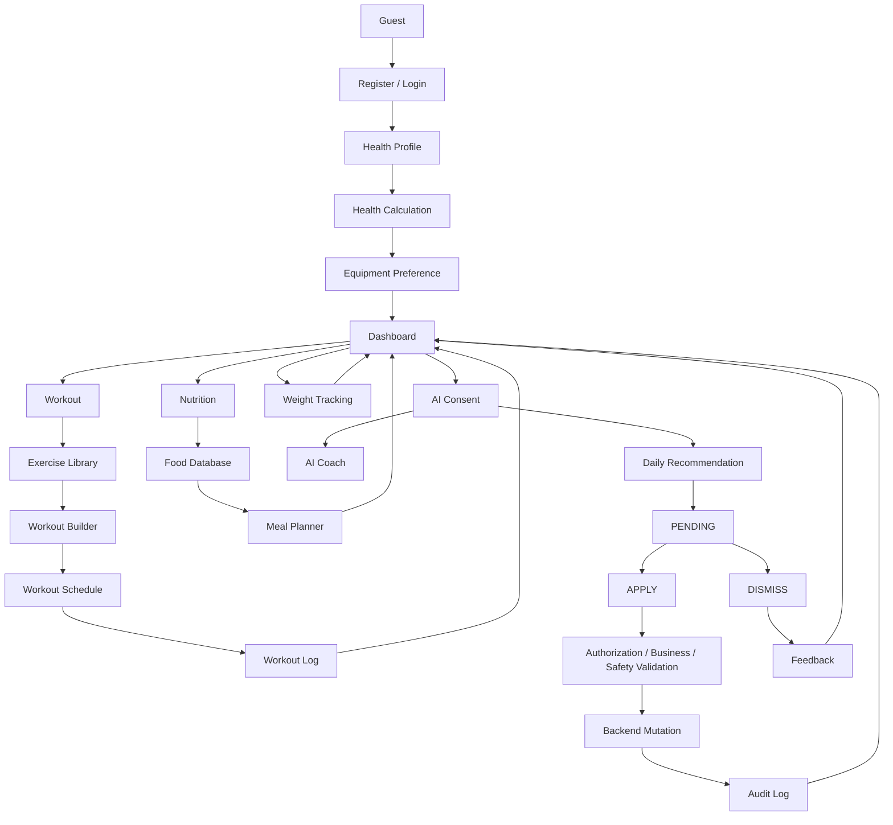
```mermaid
flowchart TD
    Guest[Guest] --> Auth[Register / Login]
    Auth --> Health[Health Profile]
    Health --> Metrics[Health Calculation]
    Metrics --> Equipment[Equipment Preference]
    Equipment --> Dashboard[Dashboard]

    Dashboard --> Workout[Workout]
    Workout --> Exercise[Exercise Library]
    Exercise --> Builder[Workout Builder]
    Builder --> Schedule[Workout Schedule]
    Schedule --> Log[Workout Log]

    Dashboard --> Nutrition[Nutrition]
    Nutrition --> Food[Food Database]
    Food --> Meal[Meal Planner]

    Dashboard --> Weight[Weight Tracking]

    Dashboard --> Consent[AI Consent]
    Consent --> Coach[AI Coach]
    Consent --> Daily[Daily Recommendation]
    Daily --> Pending[PENDING]
    Pending --> Apply[APPLY]
    Pending --> Dismiss[DISMISS]

    Apply --> Validation[Authorization / Business / Safety Validation]
    Validation --> Mutation[Backend Mutation]
    Mutation --> Audit[Audit Log]
    Audit --> Dashboard

    Dismiss --> Feedback[Feedback]
    Feedback --> Dashboard

    Log --> Dashboard
    Meal --> Dashboard
    Weight --> Dashboard
```

---

### 15.1. Traceability matrix MVP

Bảng này dùng để đối chiếu luồng nghiệp vụ với SRS, feature breakdown, screen breakdown và subsystem owner.

| Luồng nghiệp vụ | SRS Use Case | Feature IDs | Screens | Subsystem owner | Priority |
|---|---|---|---|---|---|
| Register / OTP | UC-01 | FT-ID-001 / 006 / 008 | MH05 / MH06 | Identity & Auth | P0 |
| Health Profile | UC-02 / UC-03 | FT-HP-001..004 | MH09 / MH42 | Health Profile & Body Tracking | P0 |
| Dashboard | UC-11 | FT-DB-001..005 / 007 | MH03 | Dashboard | P0 |
| Workout Library / Program / Schedule / Session / Log | UC-04..07 | FT-WO-001..011 | MH11..19 | Workout | P0 |
| Meal Planner | UC-08 / UC-09 | FT-MP-001..006, FT-MP-009 | MH20..25 | Nutrition / Meal | P0 |
| Weight Tracking | UC-10 | FT-HP-005..007 | MH43 | Health Profile & Body Tracking | P0 |
| AI Consent / Coach | UC-12 / UC-17 | FT-AI-001..007 / 014 | MH28 / MH29 / MH55 | AI Coach | P0 |
| Daily Recommendation + Apply / Dismiss | UC-13 / UC-14 | FT-AI-008..010 | MH30 / MH31 | AI Coach | P0 |
| Admin baseline + Audit | UC-19 | FT-AD-003 / 004 / 008 | MH45 / MH46 / MH47 / MH51 | Admin & Audit | P0 baseline |
| Media / Storage baseline | UC-21 | FT-MD-001..003 | Admin Exercise/Food media fields | Media / Storage | P0 baseline |
| AI Weekly Review / Plan Adjustment | UC-15 / UC-16 | FT-AI-011 / 012 | MH32 | AI Coach | P1 |
| Admin mở rộng: User / Import / AI Rule / Prompt | UC-20 | FT-AD-002 / 005 / 006 / 007 | MH48 / MH49 / MH50 | Admin & Audit | P1 |

---

## 16. Checklist đối chiếu MVP

Tài liệu này bao phủ các luồng MVP chính:

- Đăng ký/đăng nhập.
- Register + OTP verification.
- Google Login, refresh token và OTP ở phạm vi Authentication.
- Hoàn thiện Health Profile.
- Cập nhật Health Profile và tính lại BMI/BMR/TDEE/calories/macro ở Backend.
- Tính BMI, BMR, TDEE, calories và macro mục tiêu ở Backend.
- Chọn và chỉnh sửa Equipment Preference.
- Xem Exercise Library và video hướng dẫn.
- Tạo Workout Program.
- Tạo Workout Schedule.
- Ghi nhận Workout Log.
- Workout Session lifecycle (Start/Pause/Resume/Finish).
- Tính volume, completion rate và PR.
- Tìm kiếm món ăn Việt Nam.
- Lập Meal Plan theo ngày.
- Tính calories/macro theo serving multiplier.
- Theo dõi cân nặng và trend.
- Dashboard tổng hợp nutrition, workout, body và AI recommendation.
- Quản lý User Preference.
- Bật/tắt AI Personalization bằng AI Consent.
- AI Coach ở General Knowledge Mode và Personalized Mode.
- AI Context Layer do Backend xây dựng.
- Rule Engine tạo signals.
- AI Daily Recommendation 1–3 recommendation/ngày.
- Schema / Business / Safety Validation.
- Recommendation Apply/Dismiss.
- Backend mới được mutation sau khi User APPLY.
- Ownership và Security baseline.
- Media/Storage baseline cho Exercise/Food.
- Admin baseline P0 quản lý bài tập, món ăn và Audit Log.
- User Management, Admin Dashboard, Import CSV/Excel và AI Rule/Prompt ở phạm vi P1.

Các chức năng sau **không thuộc MVP** và không được đưa vào core business flow:

- Shop/Marketplace.
- Cart/Order/Payment.
- Wearable integration.
- Apple Health/Google Fit.
- Food image recognition.
- Pose estimation / Computer Vision.
- ML prediction.
- AI tự động thay đổi kế hoạch không cần User approval.

## 17. Future / Optional Flow

Các chức năng có thể phát triển sau khi P0 ổn định:

```text
P1
 ├── AI Weekly Review
 ├── User Preference Memory
 ├── Admin Import / AI Rule nâng cao
 └── AI Plan Adjustment Proposal

P1
 └── Notification local/in-app reminder (nếu còn thời gian)

P2
 ├── Notification nâng cao (push / automation)
 ├── Offline queue nâng cao
 └── Plan Adjustment mở rộng

Future
 ├── Wearable Integration
 ├── Computer Vision
 ├── ML Prediction
 └── Marketplace / Supplement ecosystem
```

Sơ đồ trực quan:

```mermaid
flowchart TD
    Stable[P0 ổn định] --> P1[P1]
    Stable --> P2[P2]
    Stable --> Future[Future]

    P1 --> Weekly[AI Weekly Review]
    P1 --> Memory[User Preference Memory]
    P1 --> AdminImport[Admin Import / AI Rule nâng cao]
    P1 --> AdjustmentProposal[AI Plan Adjustment Proposal]
    P1 --> LocalReminder[Notification local / in-app reminder]

    P2 --> Notification[Notification nâng cao / push / automation]
    P2 --> Offline[Offline queue nâng cao]
    P2 --> Adjustment[Plan Adjustment mở rộng]

    Future --> Wearable[Wearable Integration]
    Future --> Vision[Computer Vision]
    Future --> Prediction[ML Prediction]
    Future --> Marketplace[Marketplace / Supplement ecosystem]
```

Các flow Future không được xem là điều kiện bắt buộc để hoàn thành MVP.
