# Luồng Nghiệp Vụ Chính — VieGym

> Tài liệu mô tả các luồng nghiệp vụ end-to-end của VieGym, rút gọn từ [specs.md](./specs.md) để phục vụ thiết kế, triển khai, kiểm thử và demo.

---

## 1. Tổng quan luồng chính

VieGym xoay quanh hành trình người dùng từ lúc đăng ký tài khoản, hoàn thiện hồ sơ sức khỏe, theo dõi luyện tập/dinh dưỡng/cân nặng, nhận tư vấn AI và mua sắm sản phẩm hỗ trợ gym.

```text
Guest
  └── Đăng ký / Đăng nhập / Google Login
        └── Hoàn thiện hồ sơ sức khỏe
              └── Dashboard cá nhân
                    ├── Luyện tập
                    │     ├── Xem thư viện bài tập
                    │     ├── Tạo giáo án / lịch tập
                    │     └── Ghi nhận buổi tập
                    ├── Dinh dưỡng
                    │     ├── Tìm món ăn Việt Nam
                    │     └── Lập meal plan trong ngày
                    ├── Theo dõi cơ thể
                    │     └── Cập nhật cân nặng
                    ├── AI Coach
                    │     └── Tư vấn theo context cá nhân
                    └── Cửa hàng
                          ├── Giỏ hàng / đặt hàng
                          └── Chatbot tư vấn sản phẩm

Admin
  └── Quản trị dữ liệu hệ thống
        ├── User / bài tập / món ăn / sản phẩm
        ├── Đơn hàng
        ├── Nội dung AI
        └── Dashboard admin / audit log
```

Sơ đồ trực quan:

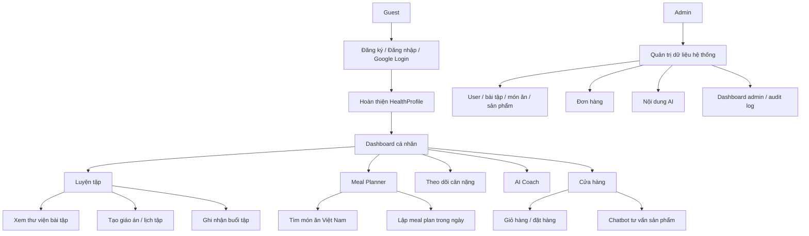

Nguyên tắc tổng quát:

- `HealthProfile` và `NutritionTarget` là dữ liệu nền cho Dashboard, Meal Planner và AI Coach.
- Mobile App chỉ giao tiếp với Backend qua REST API/HTTPS, không truy cập database trực tiếp.
- Backend Spring Boot là nguồn sự thật cho dữ liệu nghiệp vụ.
- AI Service chỉ nhận context cần thiết do Backend lọc, không tự truy cập database.
- Payment Provider chỉ tham gia khi xử lý giao dịch thanh toán online.

---

## 2. Luồng đăng ký, đăng nhập và hồ sơ sức khỏe

Luồng này là cửa vào chính của MVP. User cần xác thực và hoàn thiện hồ sơ sức khỏe trước khi hệ thống có đủ dữ liệu để tính calories, macro, dashboard và tư vấn AI.

```text
Guest mở app
  ↓
Chọn đăng ký / đăng nhập / Google Login
  ↓
Backend xác thực thông tin
  ↓
Nếu hợp lệ, Backend cấp Access Token và Refresh Token
  ↓
Kiểm tra trạng thái tài khoản
  ├── Tài khoản bị khóa / vô hiệu hóa
  │     └── Từ chối đăng nhập
  └── Tài khoản hợp lệ
        ↓
      Kiểm tra HealthProfile
        ├── Chưa có hoặc thiếu dữ liệu bắt buộc
        │     └── Điều hướng sang onboarding hồ sơ sức khỏe
        └── Đã hoàn thiện
              └── Hiển thị Dashboard cá nhân
```

Luồng onboarding hồ sơ sức khỏe:

```text
User nhập thông tin sức khỏe
  ├── Tuổi / ngày sinh
  ├── Giới tính
  ├── Chiều cao
  ├── Cân nặng
  ├── Mức độ vận động
  └── Mục tiêu tập luyện
  ↓
Backend validate dữ liệu bắt buộc
  ↓
Tính BMI, BMR, TDEE
  ↓
Tính calories và macro mục tiêu
  ↓
Lưu HealthProfile / NutritionTarget
  ↓
Dashboard, Meal Planner và AI Coach sử dụng dữ liệu này
```

Sơ đồ trực quan:

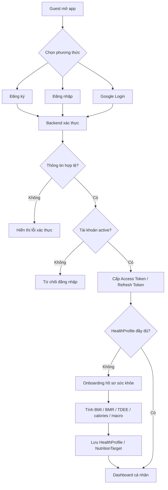

Kết quả:

- User có phiên đăng nhập hợp lệ.
- User có `HealthProfile` đầy đủ.
- Hệ thống có BMI, BMR, TDEE, calories mục tiêu và macro mục tiêu.
- Dashboard, Meal Planner và AI Coach có dữ liệu nền thống nhất.

Business rules:

- Email phải duy nhất trong hệ thống.
- Mật khẩu phải được hash an toàn.
- Access Token dùng JWT và có thời hạn ngắn.
- Refresh Token phải có khả năng thu hồi khi user đăng xuất.
- OTP cho luồng quên mật khẩu phải có thời hạn và giới hạn số lần thử.
- Tài khoản bị khóa hoặc vô hiệu hóa không được đăng nhập.
- Nếu thiếu dữ liệu bắt buộc, hệ thống không tính TDEE và yêu cầu user hoàn thiện hồ sơ.
- Khi user cập nhật cân nặng hoặc hồ sơ sức khỏe, hệ thống cần lưu lịch sử để phục vụ biểu đồ và tính toán lại nếu cần.

---

## 3. Luồng Dashboard cá nhân

Dashboard là điểm tổng hợp sau khi user đăng nhập, giúp user nắm nhanh tình trạng dinh dưỡng, luyện tập, cơ thể và các gợi ý phù hợp.

```text
User mở Dashboard
  ↓
Backend lấy dữ liệu cá nhân
  ├── HealthProfile / NutritionTarget
  ├── MealPlan hôm nay
  ├── WorkoutSchedule hôm nay / buổi tập tiếp theo
  ├── WeightLog mới nhất
  └── Gợi ý AI nếu có
  ↓
App hiển thị tổng quan
  ├── Calories, macro đã nạp / mục tiêu / còn lại
  ├── Lịch tập hôm nay và tỷ lệ hoàn thành tuần
  ├── Cân nặng hiện tại, BMI và tiến độ mục tiêu
  └── Gợi ý món ăn, bài tập hoặc sản phẩm
```

Sơ đồ trực quan:

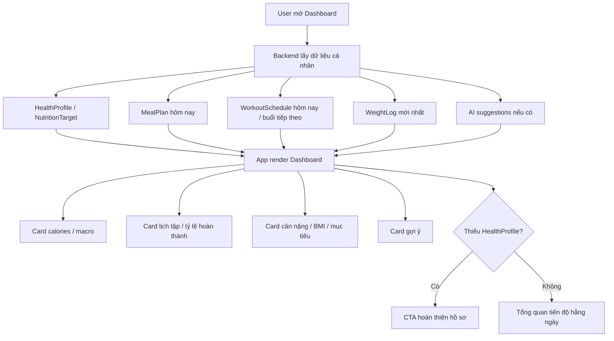

Kết quả:

- User có một màn hình tổng quan để theo dõi tiến độ hằng ngày.
- Các thay đổi từ Meal Planner, Workout Log và Weight Log được phản ánh lại trên Dashboard.

Business rules:

- Dashboard chỉ hiển thị dữ liệu của chính user đang đăng nhập.
- Nếu thiếu `HealthProfile`, Dashboard phải hiển thị yêu cầu hoàn thiện hồ sơ.
- Nếu chưa có meal plan, lịch tập hoặc weight log, app hiển thị empty state dễ hiểu thay vì dữ liệu giả.

---

## 4. Luồng luyện tập

Luồng luyện tập gồm bốn phần chính: xem thư viện bài tập, tạo giáo án, tạo lịch tập và ghi nhận buổi tập.

### 4.1. Xem thư viện bài tập

```text
User vào tab Workout
  ↓
Backend trả danh sách Exercise đang active
  ↓
User tìm kiếm hoặc lọc
  ├── Theo tên bài tập
  ├── Theo nhóm cơ
  ├── Theo thiết bị
  └── Theo độ khó
  ↓
User xem chi tiết bài tập
  ├── Video / GIF minh họa
  ├── Nhóm cơ chính / phụ
  ├── Thiết bị
  ├── Hướng dẫn thực hiện
  └── Lỗi thường gặp
```

Business rules:

- User chỉ thấy bài tập đang active.
- Admin có thể thêm, sửa, ẩn hoặc xóa mềm bài tập.
- Video/GIF lưu bằng URL an toàn hoặc object storage; database chỉ lưu metadata/object key/URL.
- Nội dung hướng dẫn nên ưu tiên tiếng Việt.

### 4.2. Tạo giáo án tập

```text
User chọn tạo giáo án
  ↓
Chọn giáo án mẫu hoặc Custom
  ├── Push Pull Legs
  ├── Upper Lower
  ├── Full Body
  └── Custom
  ↓
Nhập mục tiêu và số buổi / tuần
  ↓
Thêm bài tập vào từng buổi
  ↓
Thiết lập sets, reps, rest time và note
  ↓
Backend lưu WorkoutProgram
```

Business rules:

- Một user có thể có nhiều `WorkoutProgram`.
- Chỉ nên có một giáo án active tại một thời điểm.
- User có thể chỉnh sửa giáo án sau khi tạo.
- Nếu bài tập bị Admin ẩn hoặc xóa mềm, giáo án cũ vẫn giữ lịch sử nhưng không cho thêm bài tập đó vào giáo án mới.

### 4.3. Tạo lịch tập

```text
User tạo lịch tập
  ├── Tạo thủ công
  └── Sinh lịch từ WorkoutProgram
  ↓
Chọn ngày, giờ và nội dung buổi tập
  ↓
Backend lưu WorkoutSchedule
  ↓
Nếu user bật notification
  └── Hệ thống lên lịch nhắc tập
```

Trạng thái `WorkoutSchedule`:

- `SCHEDULED`: đã lên lịch.
- `COMPLETED`: đã hoàn thành.
- `MISSED`: đã qua nhưng chưa hoàn thành.
- `CANCELLED`: đã hủy.

Business rules:

- User chỉ xem và chỉnh sửa lịch tập của chính mình.
- Notification chỉ gửi khi user bật quyền thông báo.
- Buổi tập quá hạn có thể tự chuyển sang `MISSED` theo job định kỳ hoặc khi user mở app.

### 4.4. Ghi nhận buổi tập

```text
Đến ngày tập
  ↓
User mở buổi tập
  ↓
Nhập dữ liệu đã thực hiện
  ├── Bài tập
  ├── Sets
  ├── Reps
  ├── Mức tạ
  ├── Thời gian tập
  └── Ghi chú
  ↓
Backend lưu WorkoutLog và WorkoutSetLog
  ↓
Liên kết với WorkoutSchedule nếu có
  ↓
Cập nhật trạng thái lịch tập thành COMPLETED
  ↓
Cập nhật thống kê, PR và biểu đồ tiến bộ
```

Sơ đồ trực quan:

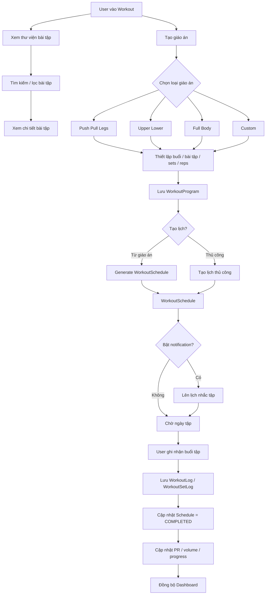

Kết quả:

- User có lịch sử tập luyện theo thời gian.
- Hệ thống có dữ liệu để tính tổng buổi tập, tổng thời gian, PR, volume và tỷ lệ hoàn thành lịch.
- Dashboard phản ánh tiến độ luyện tập mới nhất.

Business rules:

- User chỉ xem và chỉnh sửa workout log của chính mình.
- PR được tính theo bài tập, có thể dựa trên mức tạ lớn nhất hoặc estimated 1RM.
- Khi user đánh dấu hoàn thành lịch tập, dữ liệu cần liên kết với workout log tương ứng.

---

## 5. Luồng Meal Planner

Meal Planner là luồng quản lý dinh dưỡng hằng ngày, tập trung vào cơ sở dữ liệu món ăn Việt Nam và so sánh calories/macro với mục tiêu cá nhân.

```text
User mở Meal Planner theo ngày
  ↓
Backend lấy hoặc tạo MealPlan cho ngày đó
  ↓
User tìm món ăn Việt Nam
  ↓
Backend chỉ trả Food đang active
  ↓
User xem thông tin dinh dưỡng theo khẩu phần
  ├── Calories
  ├── Protein
  ├── Carbohydrate
  └── Fat
  ↓
User thêm món vào bữa ăn
  ├── BREAKFAST
  ├── LUNCH
  ├── DINNER
  └── SNACK
  ↓
User điều chỉnh khẩu phần
  ↓
Backend lưu MealEntry
  ↓
Tính tổng calories và macro trong ngày
  ↓
So sánh với NutritionTarget
  ├── Vượt mục tiêu
  │     └── Hiển thị cảnh báo
  └── Còn thiếu
        └── Gợi ý món phù hợp
```

Sơ đồ trực quan:

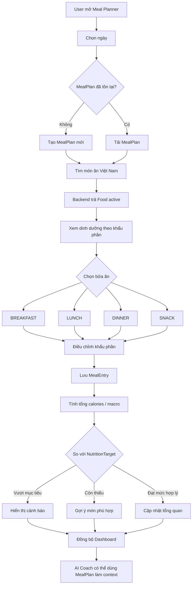

Kết quả:

- User có meal plan theo từng ngày.
- Dashboard cập nhật calories/macro đã nạp và còn lại.
- AI Coach có thể đọc meal plan hiện tại để tư vấn bổ sung hoặc thay thế món ăn.

Business rules:

- Mỗi user có một `MealPlan` theo từng ngày.
- Tổng calories/macro được tính bằng tổng các món đã thêm sau khi nhân khẩu phần.
- Nếu calories đã nạp vượt mục tiêu, hệ thống hiển thị cảnh báo.
- Nếu calories hoặc macro còn thiếu, hệ thống gợi ý món ăn phù hợp.
- Không phụ thuộc hoàn toàn vào API dinh dưỡng bên ngoài; dữ liệu món ăn Việt Nam nên được chuẩn hóa trong Food Service/dữ liệu nội bộ.

---

## 6. Luồng AI Coach

AI Coach hỗ trợ user bằng tiếng Việt về luyện tập, dinh dưỡng, kỹ thuật tập và điều chỉnh kế hoạch theo context cá nhân.

```text
User gửi câu hỏi cho AI Coach
  ↓
Backend xác thực user
  ↓
Backend xác định intent câu hỏi
  ↓
Backend gom context được phép
  ├── Mục tiêu tập luyện
  ├── Tuổi, giới tính, chiều cao, cân nặng
  ├── BMI, BMR, TDEE, calories mục tiêu
  ├── Lịch tập hiện tại
  ├── Workout log gần đây
  ├── Meal plan hôm nay
  ├── Mục tiêu macro
  └── Sản phẩm đang quan tâm nếu ở luồng mua sắm
  ↓
Backend tạo prompt an toàn và giới hạn token
  ↓
Gửi request sang FastAPI AI Service
  ↓
AI Service gọi AI Provider
  ↓
AI Service trả phản hồi
  ↓
Backend lưu hội thoại và trả câu trả lời tiếng Việt về app
```

Sơ đồ trực quan:

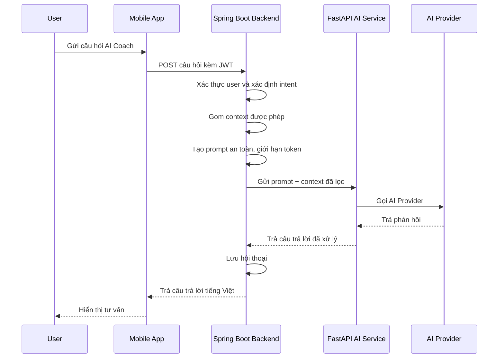

Kết quả:

- User nhận được tư vấn bằng tiếng Việt, phù hợp hồ sơ và mục tiêu hiện tại.
- Lịch sử hội thoại được lưu để user có thể tiếp tục ngữ cảnh.

Guardrails:

- AI không thay thế tư vấn y tế chuyên môn.
- Với câu hỏi liên quan bệnh lý, chấn thương hoặc tình trạng sức khỏe nghiêm trọng, AI phải khuyến nghị user hỏi bác sĩ/chuyên gia.
- AI trả lời dễ hiểu, phù hợp người mới bắt đầu.
- Không gửi dữ liệu nhạy cảm không cần thiết sang AI Provider.
- Backend phải kiểm soát prompt, context và giới hạn token để tránh chi phí vượt kiểm soát.
- AI Service không tự truy cập database.

---

## 7. Luồng theo dõi cân nặng

Luồng này giúp user theo dõi sự thay đổi cơ thể theo thời gian và cập nhật lại các chỉ số liên quan khi cần.

```text
User nhập cân nặng theo ngày
  ↓
Backend kiểm tra WeightLog cùng ngày
  ├── Đã có
  │     └── Cập nhật WeightLog hiện có
  └── Chưa có
        └── Tạo WeightLog mới
  ↓
Cập nhật cân nặng hiện tại
  ↓
Tính lại BMI và tiến độ mục tiêu nếu cần
  ↓
Nếu calories mục tiêu có thể bị ảnh hưởng
  └── Gợi ý user cập nhật lại NutritionTarget
  ↓
Dashboard hiển thị cân nặng, biểu đồ và mức thay đổi
```

Sơ đồ trực quan:

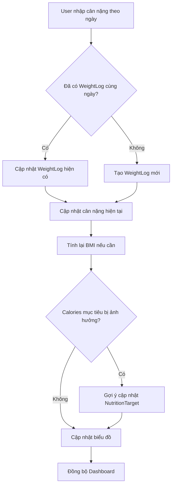

Kết quả:

- User có lịch sử cân nặng theo ngày.
- Dashboard hiển thị cân nặng hiện tại, BMI, biểu đồ thay đổi và tỷ lệ hoàn thành mục tiêu.

Business rules:

- Một ngày chỉ có một bản ghi cân nặng chính.
- Nếu user nhập lại cùng ngày thì cập nhật bản ghi hiện có.
- Khi cân nặng thay đổi, hệ thống có thể tính lại BMI và khuyến nghị calories nếu user đồng ý cập nhật.
- User chỉ xem và chỉnh sửa `WeightLog` của chính mình.

---

## 8. Luồng cửa hàng, giỏ hàng, đặt hàng và thanh toán

Luồng Shop hỗ trợ user tìm sản phẩm gym, thêm vào giỏ, tạo đơn hàng và theo dõi trạng thái xử lý.

```text
User mở Shop
  ↓
Xem danh mục hoặc tìm kiếm sản phẩm
  ↓
Xem chi tiết sản phẩm
  ├── Ảnh
  ├── Giá
  ├── Mô tả
  ├── Thành phần / cách dùng
  └── Tồn kho
  ↓
Thêm sản phẩm vào giỏ hàng
  ↓
Cập nhật số lượng hoặc xóa khỏi giỏ
  ↓
Checkout
  ↓
Backend kiểm tra tồn kho và snapshot giá
  ↓
Tạo Order và OrderItem
  ↓
User chọn phương thức thanh toán
  ├── COD
  │     └── Order chờ xác nhận
  └── Online
        └── Payment Provider xử lý giao dịch
  ↓
User theo dõi trạng thái đơn hàng
  ↓
Admin xác nhận, giao hàng, hoàn thành, hủy hoặc hoàn tiền
```

Sơ đồ trực quan:

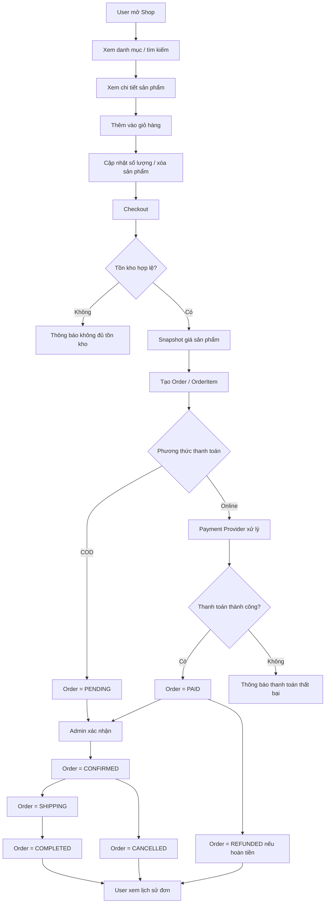

Trạng thái `Order`:

- `PENDING`: đơn hàng mới tạo, chờ xác nhận.
- `CONFIRMED`: đã xác nhận.
- `PAID`: đã thanh toán.
- `SHIPPING`: đang giao hàng.
- `COMPLETED`: hoàn thành.
- `CANCELLED`: đã hủy.
- `REFUNDED`: đã hoàn tiền.

Business rules:

- Giá sản phẩm tại thời điểm đặt hàng phải được lưu vào `OrderItem`.
- Không cho đặt số lượng vượt tồn kho nếu hệ thống quản lý tồn kho realtime.
- User chỉ xem đơn hàng của chính mình.
- Admin có quyền xem và cập nhật trạng thái tất cả đơn hàng.
- Payment secret và thông tin tích hợp cổng thanh toán chỉ lưu server-side.

---

## 9. Luồng Chatbot bán hàng

Chatbot bán hàng hỗ trợ user chọn sản phẩm phù hợp với mục tiêu tập luyện, nhu cầu và ngân sách trong quá trình mua sắm.

```text
User đang ở Shop hoặc chi tiết sản phẩm
  ↓
User hỏi chatbot bán hàng
  ↓
Backend xác thực user
  ↓
Backend lấy context mua sắm phù hợp
  ├── Mục tiêu tập luyện
  ├── Nhu cầu sản phẩm
  ├── Ngân sách nếu user cung cấp
  └── Danh sách sản phẩm active / còn hàng
  ↓
AI tư vấn, so sánh hoặc gợi ý sản phẩm
  ↓
App hiển thị câu trả lời
  ↓
User xem chi tiết sản phẩm hoặc thêm vào giỏ
```

Sơ đồ trực quan:

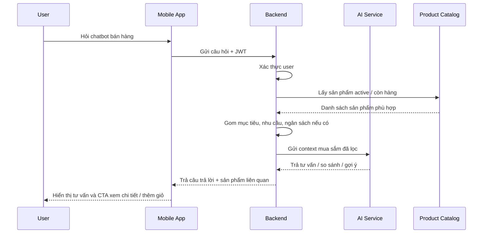

Kết quả:

- User được hỗ trợ chọn sản phẩm phù hợp hơn.
- Shop có thể điều hướng user từ hội thoại sang chi tiết sản phẩm hoặc giỏ hàng.

Guardrails:

- Chatbot chỉ gợi ý sản phẩm đang active và còn hàng nếu có quản lý tồn kho.
- Chatbot không được đưa ra cam kết y tế hoặc điều trị bệnh.
- Với thực phẩm bổ sung, chatbot phải khuyến nghị user đọc kỹ hướng dẫn sử dụng và tham khảo chuyên gia nếu có bệnh lý.
- Chatbot chỉ dùng context mua sắm cần thiết, không gửi dữ liệu nhạy cảm không liên quan.

---

## 10. Luồng Notification

Notification là luồng hỗ trợ giúp user duy trì thói quen tập luyện, dinh dưỡng, theo dõi cơ thể và cập nhật đơn hàng.

```text
Hệ thống phát sinh sự kiện cần nhắc user
  ├── Sắp đến giờ tập
  ├── Chưa nhập meal plan
  ├── Đến kỳ cập nhật cân nặng
  ├── Đơn hàng đổi trạng thái
  └── Có gợi ý AI phù hợp
  ↓
Kiểm tra user đã bật notification hay chưa
  ↓
Kiểm tra loại thông báo được phép gửi
  ↓
Tính thời điểm gửi theo múi giờ phù hợp
  ↓
Gửi notification đến thiết bị của user
```

Sơ đồ trực quan:

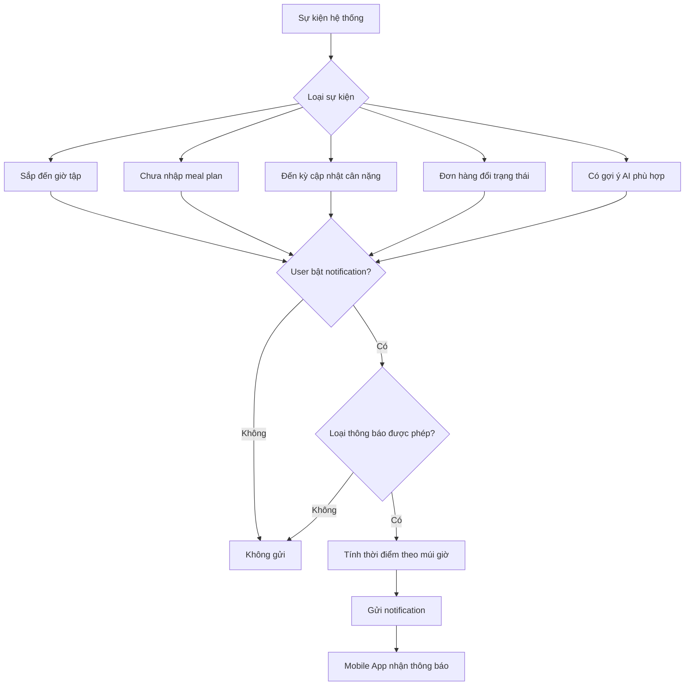

Business rules:

- Notification chỉ gửi khi user bật quyền thông báo.
- User có thể bật/tắt từng nhóm thông báo nếu hệ thống hỗ trợ cấu hình chi tiết.
- Notification phải phù hợp múi giờ của user.
- Không gửi thông báo marketing nếu user chưa đồng ý.
- Nhắc lịch tập chỉ gửi với lịch chưa hoàn thành hoặc chưa bị hủy.

---

## 11. Luồng Admin

Admin quản trị dữ liệu dùng chung, đơn hàng, nội dung AI và các chỉ số vận hành của hệ thống.

```text
Admin đăng nhập
  ↓
Backend xác thực JWT và role ADMIN
  ↓
Admin truy cập màn quản trị
  ├── Dashboard admin
  ├── Quản lý người dùng
  ├── Quản lý bài tập
  ├── Quản lý món ăn Việt Nam
  ├── Quản lý sản phẩm và tồn kho
  ├── Quản lý đơn hàng
  └── Quản lý prompt / rule AI
  ↓
Admin thực hiện thao tác quản trị
  ↓
Backend validate quyền và dữ liệu
  ↓
Backend cập nhật hệ thống
  ↓
Ghi audit log cho thao tác quan trọng
```

Sơ đồ trực quan:

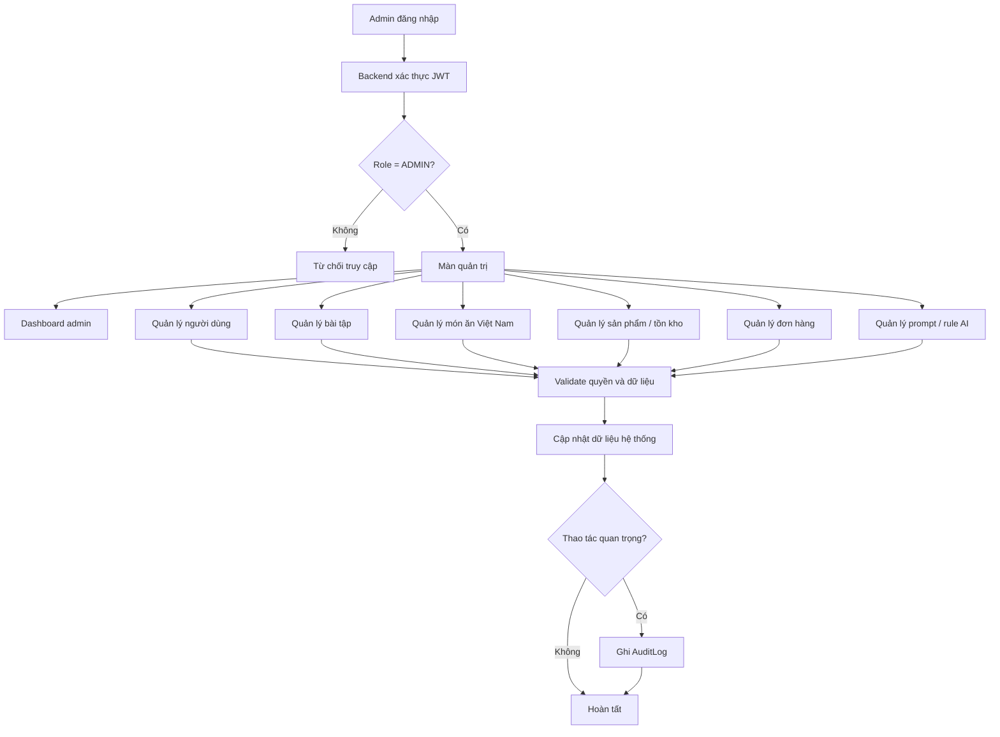

Kết quả:

- Dữ liệu bài tập, món ăn, sản phẩm và đơn hàng được quản trị tập trung.
- Dashboard admin có số liệu về user, bài tập, món ăn, sản phẩm, đơn hàng, doanh thu và top item nếu có dữ liệu.

Business rules:

- Admin không được xem mật khẩu hoặc refresh token của user.
- Các thao tác quan trọng nên được ghi audit log.
- Xóa dữ liệu chính nên dùng soft delete để tránh mất dữ liệu trong quá trình demo và vận hành.
- Admin quản lý dữ liệu dùng chung, nhưng dữ liệu cá nhân của user vẫn cần kiểm soát truy cập phù hợp.

---

## 12. Luồng bảo mật và phân quyền

Luồng bảo mật áp dụng cho toàn bộ API riêng tư của hệ thống.

```text
Client gọi API riêng tư
  ↓
Backend kiểm tra Access Token
  ↓
Xác định userId và role
  ↓
Kiểm tra quyền truy cập tài nguyên
  ├── USER
  │     └── Chỉ truy cập dữ liệu thuộc chính mình
  └── ADMIN
        └── Truy cập API quản trị theo quyền admin
  ↓
Nếu hợp lệ
  └── Xử lý nghiệp vụ
  ↓
Nếu không hợp lệ
  └── Trả lỗi xác thực hoặc phân quyền
```

Sơ đồ trực quan:

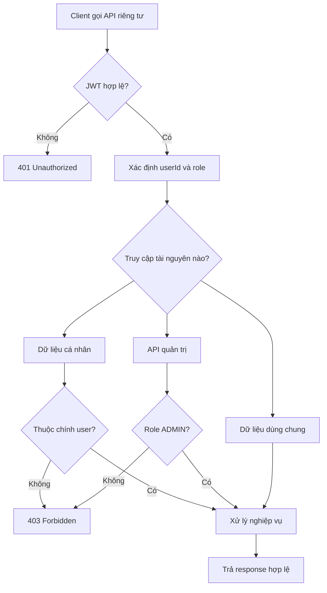

Business rules:

- API riêng tư bắt buộc có JWT hợp lệ.
- Backend phải kiểm tra authorization, không chỉ ẩn nút hoặc màn hình ở frontend.
- User không được xem `HealthProfile`, `MealPlan`, `WorkoutLog`, `WeightLog` hoặc `Order` của user khác.
- AI Provider API key, JWT secret và payment secret chỉ lưu server-side.
- Upload media cần validate MIME type, kích thước và extension.

---

## 13. Checklist đối chiếu MVP

Tài liệu này bao phủ các luồng MVP chính:

- Đăng ký/đăng nhập.
- Hoàn thiện hồ sơ sức khỏe.
- Tính BMI, BMR, TDEE, calories và macro mục tiêu.
- Xem Dashboard cá nhân.
- Xem thư viện bài tập và tạo lịch tập cơ bản.
- Ghi nhận workout log.
- Tìm kiếm món ăn Việt Nam và lập meal plan trong ngày.
- Chat với AI Coach dựa trên hồ sơ, mục tiêu và dữ liệu user.
- Xem sản phẩm, thêm vào giỏ hàng và tạo đơn hàng cơ bản.
